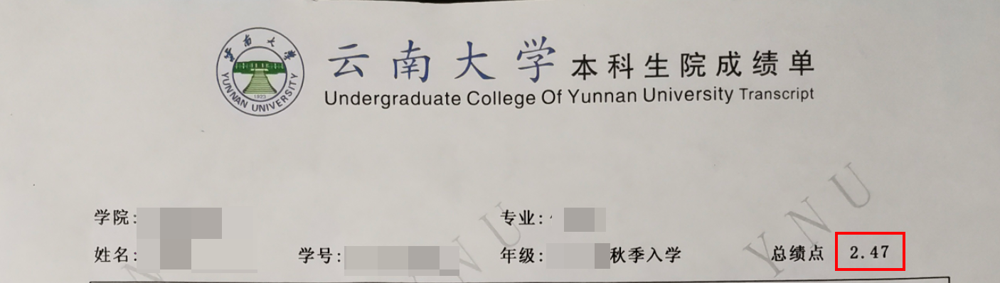
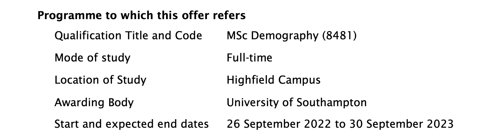

## 第一章 选学校定项目

留学申请，第一步是确定要申请的项目。前面我提到过，在一个申请季中不可能只申请一个项目，而应该多个项目一起申请，来增加录取率，以及给自己相对较多的选择。第一步是选学校定项目的原因也在于，每个项目都有自己的材料和申请时间要求。比如有的要求一封推荐信，有的两封。因此，在确定好项目后，我们才能制定详细的时间表来准备申请材料和递交申请。

### 1.1 申请什么项目，多少项目？

**什么项目？**

> 项目指的是 Programme (英式) 或者 program (美式)，很多同学也称之为「专业」。

首先我需要带大家了解一下英国研究生项目的主要类别，然后稍微过一下其他国家的情况。

英国研究生大概有这些 [类别](https://www.york.ac.uk/study/postgraduate-taught/courses/about/)：

1. 一学期（大概六个月）授课型研究生证书 (Postgraduate Certificate，简称 PG Cert，不需要写毕业论文)
2. 两学期（大概九个月）授课型研究生文凭 (Postgraduate Diploma，简称 PG Dip，不需要写毕业论文)
3. 一年制授课型研究生（最为常见）(Taught Master's Programmes，或 Postgraduate Taught Degrees，简称MA 或者 MSc、MS)
4. 两年制授课型研究生（同上，极少）
5. 一年制研究型研究生（Postgraduate Research Degrees/Programmes，或 MSc by Research，简称 MRes 或 MPhil）
6. 两年制研究型研究生 (同上，较少)

一般来讲，我们不建议申请 PG Cert 和 PG Dip。这些学位回国后是几乎不会被认证为硕士学位的；即使在国外，这些项目也很难获得硕士学位的认可。不过这些项目通常竞争比较小，录取概率高。比如 LSE 的 [Diploma in Accounting and Finance](https://www.lse.ac.uk/study-at-lse/Graduate/degree-programmes-2021/Diploma-Accounting-and-Finance) 的录取率就要高于它的硕士版本 [MSc Accounting and Finance](https://www.lse.ac.uk/study-at-lse/Graduate/degree-programmes-2021/MSc-Accounting-and-Finance) 很多。Diploma 2019年的申请人数为 142 ，录取了 34 人，录取率 24% ；而硕士则有 1800 个申请，录取率大约为 16% 。事实上，大部分中国同学并不会申请这个，中介也不会给你推荐这些项目。

在英国申请中最常见的，是一年制的授课型硕士，也是大家最普遍关注的。这些硕士通常是一年，从九月份到第二年九月份，然后在次年的12月份，1月份，（有时候）二月份发放学位证书。这一年会分为三个学期，第一、二学期是上课，每个学期 60 个学分，然后在第三学期（也就是暑假的时候），写毕业论文，占 60 个学分。毕业的时候一共 180 个学分。也有一少部分两年制的授课型研究生，这些项目通常是英国大学和欧洲其他大学一起管理的，学生会去到多个国家学习，有正常的寒暑假可以实习，毕业的时候拿至少两个大学颁发的学位。这些项目较少，年均学费一般会低于一年制的授课型硕士，对学生背景要求不高，录取率高；但是平均来讲，这些项目中的学校的排名不会很高。格拉斯哥大学有大约 6 个这样的项目。

根据学科或者学校传统的不同，授课型硕士还有这些区分：Master of Science (简称 MSc 或者 MS), Master of Arts (MA), Master of Business Administration (MBA), Master of Publlic Administration (MPA), Master of Laws (拉丁文为 Legum Magister，故简称 LLM[^1])。不管归类是什么，这些都是完整的硕士学位。有同学可能会认为 MSc 是理科，而 MA 是文科，前者比后者更要严格，更受认可一些。其实不一定。

[^1]: 有同学可能好奇，法学硕士的拉丁文为 Legum Magister，那么它的简称不应该是 LM 吗？这就要引入拉丁文的一个习惯用法。在拉丁文中使用简称时，如果要表示一个单词的复数形式，那么一般会重复该单词的第一个字母。Legum 是 Laws ，一个复数。所以 LM 应该加一个 L 变成 LLM。再比如我们经常看到英语老师用 PP 做为 pages 的简写，也是因为这个原因。

除了授课型硕士，英国还有研究型硕士。研究型硕士分为两种：MSc by Research (or Master of Research (MRes)) 和 Master of Philosophy （MPhil）。一般来讲，对于正常的本科生来说，可以直接申请部分 MRes （申请较难，一年） 和少部分 MPhil （申请更难，两年）。其中两年研究型硕士往往可以转到博士项目中去。研究型硕士一般没有授课（有的项目可能会在第一学期让学生补一些研究方法 「research methods」的课程），大部分时间是学生在导师的指导下做研究。这也意味着，每一个研究型硕士的学生在入学时就会被指派一名导师。这类项目在申请的时候往往需要提交研究提案（Research Proposal），且申请难度一般偏高。如果是本科生去申请，一般需要比较好的学术成绩。研究型硕士通常是之后读博士 (PhD) 很好的跳板。申请研究型硕士会需要多交一些材料，有可能会包括：写作样本、研究提案。

**申请多少项目？**

曾经北辰光有一个来自川北医学院（川内一本，川外二本）的同学，均分 81。她当年只申请了两个项目，一个 UCL，一个 Leeds，最后两个都拿到了录取。也有一个同学申请了接近 20 个项目最后才勉强拿到了自己满意的录取。这两个都是比较极端的情况，我们的建议是，在追求梦校的学校的路上，申请项目数量不应该成为阻挡你的理由。

通常情况，我建议在一个申请季中申请 5-8 个项目 (programme)。根据经验，这样工作量不会太大，且合理地最大化了录取率和选择空间。在北辰光，我们建议时间精力充足的同学 DIY 申请 8 个项目，较少时间精力的同学申请6个。大原则是，在时间精力允许的情况下，你应该尽可能多申请项目。这就好像是在射箭，你手上的箭矢越多，射中靶心的概率也就越大；同样的，你申请的项目越多，拿到最理想的录取的概率也就越大。虽然申请额外的项目需要时间，以及申请费（部分项目收取，平均大概 500 一个），但是这个是非常值得的投资；试想一下，录取第一志愿和第二志愿的差别会小于这 500 元吗？你可能遇到更好的老师，在交通更便利的地方（光是这个就能节省不止 500 元），与更优秀的同学成为朋友等等，不一而足。况且，绝大部分的项目都是不用申请费的；这就意味着，多申请一个项目需要做的就是填写一次网申，把个人陈述（以下简称 PS ）和简历等材料按照要求修改一下即可。（大多数情况下，修改 PS 即可。修改简历以符合各个项目的要求虽然理论上是可取的，但是实践中，我们感觉这样做对大部分工作经验在三年以下的同学们意义不大。）

另外，除非学校特别规定，那么一个学校可以申请多个项目。比如剑桥、牛津、KCL（伦敦大学国王学院）、爱丁堡、曼彻斯特等等都是可以在一个申请季里面申请多个项目的。

有特别规定的学校有：

1. LSE 一个申请季（一年）只能申请两个项目；如果两个申请全部被拒绝，那么还可以通过官网的一个表格递交两个申请，该申请需要交申请费。
2. IC （帝国理工）商学院：一个申请季只能申请一个，第一志愿为金融硕士的可以额外申请一个项目；其他学院的项目则一个申请季只能申请两个。

有同学可能会问，一个学校申请多个项目会不会被招生官认为是动机不明确？这个问题其实很难严格地去推理，因为每个学校的情况不一样。首先这个问题的前置条件是，在招生官拿到我们的申请材料时，他们知道我们在这个学校所有的申请。所以，他们知道吗？我们知道对方知道吗？都很难说。

我们有理由推测，如果我们申请的是同一个学院的多个项目，且这个学院的招生团队很可能由那么几个固定的人负责这些项目的招生工作，那么就有可能招生团队中的某一个人发现你申请了多个项目。但是这并不意味着他们就会认为你动机不纯。如果你申请的同一个学校，不同部门的项目，那么被发现申请多个项目的可能性相对会低很多。但是说实话，即使被发现，也不意味着会影响申请。

从经验角度来说，申请同个学校，甚至同个部门的多个项目有利于最大化录取率，尤其是你想要冲刺名校的时候。北辰光曾经有一位同学特别希望去到 UCL ，于是我们帮助他申请了八个项目，有三个项目是同一个部门的，即 UCL 的巴特莱建筑学院。最后他成功拿到该学院的两个 offer。也有一位同学，申请了 UCL 教育学院的两个项目，最后也都拿到了 offer。其他学校我们也有相应的案例。所以，尽管从理论层面上来讲，申请多个项目有可能会影响，但是这个影响并没有特别大。

正常情况下，一个学校申请 1-2 个项目即可。如果对某个学校特别钟情，申请 3-5 个也是可以的。

> 注意，从 2021 年 11 月开始，UCL 每年每个学生只能申请 2 个项目。

在确定我们要申请的项目数量后，我们便可以开始搜寻合适的项目。在本书中，我们假定同学们一共申请 8 个项目。

具体申请哪些项目就是非常重要的决策了。这个部分相对需要依赖经验。很多同学能够做出一个比较合理的项目选择，但是往往不是最优的。每年都有不少同学拿到“全聚德”，即被所有申请的项目拒绝。这很可能是其在选校定项目时过于激进导致。当然如果该同学目标比较专一，且无所谓休学（GAP）一年再次申请，那么只申请自己特别想去的几个项目或者学校也是可以理解的。

有经验的咨询师在定项目的时候会知道更多的选择，他们的信息和学校更加同步，对于学生背景和项目录取要求是否匹配也能够做出更加精准的判断。因此，经验充分的咨询师能够在这个层面减少申请中的不确定性，增加拿到理想录取的概率。不过你不需要担心，在本书，我会把我从经手 500+ 案例的经历中提炼出来最有用的内容详细地讲解给你，让你在最后在不需要咨询师的帮助下也能够做出最合理的项目选择。

### 1.2 去哪找项目？

采用混合的定项目方式。

混合的定项目方式意味着考虑自己多个方面的需求，包括生活，交通，职业发展，学术发展等需求。

> **工欲善其事必先利其器**

> 在国内访问国外大学的网站和申请系统可能会比较慢，我们建议你在搜寻项目的过程中，（以及之后填写网申的时候），全程使用「科学上网」，并且使用谷歌做为搜索引擎。百度搜索会展示很多的广告和无关内容，让你掉入一些坑里面，或者得到的不完整、甚至错误的信息。

#### 1.2.1 学校官网

众多信息来源中，最值得信赖的渠道是学校的官网项目列表。几乎每一个学校都会有一个项目的列表，列出来所有当年可以申请和就读的项目，方便学生检索。建议大家一定要利用好这个资源。大家可以谷歌以下词组来快速找到这样的列表：「学校名」+ taught master's programme full list。

如果你有比较想去的学校，那么你可以去到学校的官网查看它的项目列表。相比于其他渠道的信息，学校官网提供的信息永远是最权威、最新的。这就意味着，如果你直接看官网，你会比起其他人更快了解今年新开了哪些项目，而不用等到其他人发现了，在网上分享出来后才知道。同理，你也能够更快确定一个项目是否在今年关闭了。

**注意**

有些时候，学校官网的信息会和实际情况背离。

比如南安普顿大学的一个名为 Demography (MSc) 的项目的要求是 2:1 学位。而官网的 list 规定，来自云南大学的申请人，必须绩点达到 2.8/4.0 才算作是 2:1 。而实际上，我们有一位云南大学的同学绩点只有 2.47/4.0 最终也成功拿到了 offer。当时我们之所以仍旧选择申请这个项目主要是考虑到这个项目相对冷门，竞争者少，值得一试。

（UCL 近两年录取政策变动比较频繁，下面的要求已经改变，在此举例仅做示例。）

另外在UCL的官网上，如果一个项目的要求是二等一学位，那么对于来自中国的同学，它会要求85分及以上的绩点。试想，国内那些学术标准很高，给分偏低的学校的同学，拿到 85 分会很难。而反而是打分比较松的学校的同学容易分数高。那么如果 UCL 真的这么一刀切，它的生源可能就真的不利于长远的发展。所以我认为，面对一刀切的情况，我们要根据自己的学校情况来相应地解读学校的录取政策。

关于 UCL，事实上，我们有很多同学的绩点只有 82 分，最后也成功拿到这些 UCL 二等一学位要求的项目的录取。在此我觉得可以大概这么理解：

| UCL 官方要求 | 官方中国成绩要求 | 实际成绩要求（985）                    | 实际成绩要求（211和部分优秀院校） | 实际成绩要求（其他学校） |
| ------------ | ---------------- | -------------------------------------- | --------------------------------- | ------------------------ |
| 2:1          | 85               | 82 （如果offer 还是con 85 可以 argue） | 84 （如果 con 85可以 argue）      | 90                       |
| 2:2          | 80               | 78                                     | 80                                | 82                       |

如果你有三年或者以上的该行业的工作经验，那么很多项目的招生可能会降低 2-5 分的均分要求。

同时，也请大家注意的是，学校官网的信息和特定的项目的要求也有可能存在不一致。比如说有些项目的介绍中要求提交的文书的字数上限是 1000 字，但是在申请的时候，系统里面的上限却是 500 字。再比如，新加坡国立大学（NUS）的官方申请系统要求申请者在申请的时候提交资产证明，而NUS的金融硕士招生组在他们的申请指南中告知学生可以不提交这个证明（2021 年）。这样的情况也出现在其他学校和项目的申请中。再比如，有一次，有一位同学说他去年拿到了爱丁堡大学一个叫做 Digital Society MSc 的 offer 。而当我们去看这个项目信息的时候，发现在爱丁堡大学的官方硕士项目招生目录中（2021年），它已经不存在了。于是我们去到这个项目之前所在的社会学系去查看这个系开设的所有项目，发现一个叫做 Digital Sociology MSc 的项目。我们发现，社会学系的官网上，这个项目的名字并不统一。网页标题虽然是 Digital Sociology MSc ， 但是在对该项目的介绍上，很多时候用的还是 Digital Society MSc。

造成不一致性的原因可能是项目所在的院系修改了录取要求和项目信息，而学校官网和申请系统没有及时更新，vice versa。一般来说，我们要以该项目的官网，以及该项目所在的部门提供的信息为准。如果还是无法得到准确的信息，我们可以发邮件联系项目负责人或者学校的招生办公室（以前者的信息为准）。另外，有个时候，你发邮件过去询问并不能得到你所需要的。假如你想要验证我上面说的关于 UCL 对中国学生均分的要求，他们还是会回复给你官网的要求，顶多加一句「我们会根据学生的综合情况来决定对绩点的要求。」这个时候，你就应该适当接受「民间」的说法了。P.S. 北辰光博客和公众号发布的 offer 信息都是绝对真实的，我们有详细的资料可以证明信息的真实性。如果需要查看相关资料，请联系北辰光的客服。

在浏览学校的招生项目的目录是，你应该保持一个开放的态度，看一看那些你可能理所应当认为和你无关的项目，把它们加入到你的备选中。你应该看一下这些项目的录取要求，课程设置，是否是全职学习[^2] (Full-time) 等等。在这个阶段，你要尽可能地把更多项目纳入到你的备选中。所以一些你觉得自己录取率低的项目可以先在这个阶段加入到备选里面，一些你觉得自己可以勉强接受的专业也可以加入进来。

[^2]:注意，如果你不是英国公民，没有英国永居卡或者其他能够允许你在英国长期生活居住的证件，那么你是无法申请 part-time 授课的项目的。

#### 1.2.2 城市

如果你有特别想去的城市，比如伦敦，你也可以以城市为出发点搜寻合适的学校和项目。不管是在农村还是城市，你都能找到不错的英国大学。位置相对偏僻的大学可能更能让人专心学习，和学校的同学老师产生更多联系。在大城市学习也有其好处。如果你在伦敦，你可以随时去到世界一流的博物馆，时装周，学术论坛，商业活动，你更有可能接触到最先进的技术和你所在领域的领先人物等；同时你也能够更深入地了解英国社会，接触到不同行业、不同背景的人；这些，将是你人生中宝贵的财富。

也许你已经读出来北辰对城市的喜爱了。有人会说，真正的英国在乡下、在农村，那里保留着英国最传统的文化。的确如此。但是绝大部分英国人都居住在城市，他们在城市所构建的社会是英国这个大社会的很大一个成分。英国的城市社会更开放，更先进，更包容，更全球化，更接近未来英国社会形态。在英国脱欧全民投票时，大部分农村居民投票脱欧，而伦敦等大都市地区的居民选择的是留在欧盟。事实上，在英国的大城市对我们国际学生更加包容，我们会受到更少的歧视，排挤。同时，想要融入英国农村也是相对困难的，首要的就是当地的口音和居民们相对封闭的心态。在大城市，我们也能够学到更加标准、通用的英语，结识到日后对我们职业发展有益的朋友。

当然大家也不用担心如果要去在农村地区的学校，或者说苏格兰，爱尔兰，威尔士的学校，我们会听不懂当地的英语。首先，在大学里面，大家都是使用标准的英语（可能会有一点点口音的痕迹）。所以你不用担心学习方面会受到很大影响。另外，最差的情况下，如果当地的英语有比较强的口音，大学会在开学时做一些培训，让我们能够很快熟悉这些英语口音。我们自己也可以提前做一些功课。最后，在发现我们是国际学生后，当地人也会比较注意自己的口音，尽量用标准的英语和我们对话。

另外，如果大学在大城市，那么我们在平常放假的时候去到农村或者其他地区游玩也比较方便。而如果在农村的话，去其他地方则会相对不方便。且英国大城市，比如伦敦，曼彻斯特，伯明翰，爱丁堡，他们的机票都特别便宜，有很多特价机票（往返低于 200 元RMB的那种）。如果你能够提前安排好，在英国读书一年，去英国各个主要城市和地区逛一圈是完全可以实现的，而且不需要花费很多。如果你特别喜欢欧洲，去欧洲的机票也非常便宜，在这一年也可以把欧洲的主要景点也逛个遍（在平衡好学习的情况下……）。

在确定你心怡的城市后，你可以看看这个城市有哪些有名的大学，然后去看看这些学校开设的项目，并且挑选一些可以考虑的项目。

#### 1.2.3 排名

排名选校法就是先确定自己希望申请排名在什么段位的大学。然后再根据其他条件来做进一步筛选。一般我们建议平均分在 80 分以上的本科生（不管是三本、二本或者一本）尝试申请世界排名在 120 以内的英国大学，75 分以上的尝试申请 150 以内的大学（2022 年）。你可以打开一个排名网站，找出排名适合的大学，然后找到对应的学校的官网，看是否有你喜欢的项目。

现在越来越多的同学开始根据排名来挑选学校和项目。不可否认，对于并没有在英国生活过或者深入了解过英国大学的人来说，排名是一个很好的切入点，能够让大家少走很多弯路。但是根据我们的经验，绝大部分同学认为国内 HR 只关注 QS 排名，于是他们在选校的时候也只关注这个排名。这样做其实并不利于大家的长远发展。QS 排名并不是一个最权威的排名（虽然它确实是一个做得比较细致、用户体验较好、且推广力度大的排名），也几乎没有任何排名是客观的，他们的排名机制中总会有一些排名者的主观因素。在 HR 对国外大学不了解的时候，选择只参考 QS 也是一个比较合理的策略。但是这样的情况不会永远持续下去。等 HR 们开始慢慢对海外学校有更多了解后，等中国 HR 这个行业慢慢发展成熟后，HR 们会开始用更加综合、全面的方式来评估一个人的教育背景。我认为，一个面向未来的学生会选择让自己为未来做好充分准备，而不是被当下不成熟的市场环境和行业做法所限制住。 

所以，这一步中非常重要的点就是参考尽可能多的排名网站。结合每一个排名的结果来综合地判断一个项目是否值得申请和入读。

**综合排名**

综合排名是指学校整体的排名。比较权威的综合排名有这些：

1. QS World University Ranking， QS 排名 
2. THE Ranking， 泰晤士排名
3. U.S. News & World Report Rankings， 美国新闻与世界报道排名
4. ARWU， 上海排名 （全称 Academic Ranking of World Universities ，中文也叫做软科世界大学学术排名，以下简称为「上海排名」）

当你确定想去一个学校的时候，一定要注意参考这个学校在这四个排名里面的排名情况。当你有很多学校需要对比的时候，我们建议将他们的所有排名做一个平均，来得到一个相对更加接近实际情况的排名（这个做法是有一定的统计学原理支撑的，详情见 [此论文]([kddexp6.dvi (psu.edu)](https://citeseerx.ist.psu.edu/viewdoc/download?doi=10.1.1.401.8553&rep=rep1&type=pdf))）。

你可以用这样一个表格：

| 学校名 | QS 排名 | 泰晤士排名 | U.S. News | 上海排名 | 平均排名 |
| ------ | ------- | ---------- | --------- | -------- | -------- |
|        |         |            |           |          |          |
|        |         |            |           |          |          |
|        |         |            |           |          |          |

当然你也可以不用简单平均，而是根据你对某一个排名的重视程度而给出相应的权重，最后得到一个加权的排名。这样，通过比较这个调整后的排名，你会更加清楚每一个学校更准确的排名情况。

注意

英国的卫报，也就是 [Guardian]([The best UK universities 2021 – rankings | Education | The Guardian](https://www.theguardian.com/education/ng-interactive/2020/sep/05/the-best-uk-universities-2021-league-table)) （一个新闻媒体公司），每年也会发布一个英国大学的排名。我认为这个排名对绝大多数人来说没有价值。因为它采用的 [排名标准](https://www.theguardian.com/education/2020/sep/05/methodology-behind-the-guardian-university-guide-2021) 比较缺少学术性，因而和其他排名相差甚远。比如，圣安德鲁斯大学（University of St Andrews）在这个排名上是第二名，超过剑桥，帝国理工， UCL 等学校；兰卡斯特大学（Lancaster University）大学的排名也在一众响亮的名字之前，比如布里斯托、格拉斯哥、爱丁堡、曼彻斯特等。

事实上，我们来看一看它排名时主要参考的因素就知道它为什么会产生一个「超出大部分人认知」的排名结果了。

1. Entry standards, 平均录取分数，15%
2. Student-staff ratios, 学生-教师比， 15% 
3. Expenditure per student, 学校在每学生的花费， 5% 
4. Continuation, 升学率，10% 
5. Student satisfaction 学生满意度
   1. teaching quality, 对教学质量满意度，10% 
   2. feedback, 对教师的反馈满意度， 10%
   3. overall satisfaction, 总体满意度， 5% 
6. Value-added scores, 对学生优秀表现贡献度， 15%
7. Career prospects, 就业率，15%

你会发现，这么多的标准中，竟然没有一条是和学校的学术声誉、学术表现直接相关的。这个排名更多的数据来自于学生填写的问卷调查，而这些数据并不权威可靠。

**学科排名**

如果你特别希望去到你想要深造领域最强的学校，那么你需要参照专业排名。顾名思义，专业排名给每一个学校的某一个学科、专业领域排名，比如商学院排名就是给大学的商学院排名。这就意味着，有些大学如果没有该专业，那么它就不会出现在这个排名上面。而有些特殊的研究所、机构、小学校，因为有这个专业，也会出现在排名上面。再用商学院排名举个例子。有些学校，比如大名鼎鼎的 ETH Zurich （苏黎世联邦理工学院，2021 年 QS 全球排名第六）就没有商学院。它就不会出现在商学院的排名上面。相反，伦敦商学院作为全球顶尖的商学院，在 2021 年 QS 商学院全球排名第三，而它却不在 QS 全球排名的院校列表中 （它的排名显示为 N/A）。

上面提到的学校综合排名也提供学科排名，只是各自对学科的划分并不一致，有些划得很细，有些很广。QS 的学科排名划分出了 51 个学科，上海排名 54 个，US  News 38个。

除了这些广为人知的学科排名，我们也需要了解学科内部的权威排名。这些排名只排一个学科，且因为是学科内部领域的教授学者等给出的排名，所以它们往往更受该学科圈子内部的人的认可。比如，我本科和研究生所读的经济学就有一个非经济学学生都不太知道的排名：[IDEAS 排名]([Economics rankings: Economics Departments | IDEAS/RePEc](https://ideas.repec.org/top/top.econdept.html))。这个排名是经济学领域的学者，研究人员会经常参考的排名。

你可以通过简单的 Google 搜索来寻找你深造领域的学科排名（建议使用英文关键词进行搜索，如： economics subject/department ranking）。不过首先建议你咨询一下该领域的老师、博士生、研究生。中文互联网上面也有很多相关的帖子和讨论，大家可以多浏览浏览。

如果你希望去到该领域最强的院系，你会发现，时不时，不少顶尖的院系不在大学里面，而是一个独立的研究所或者机构。比如我们刚才举例的，如果你觉得希望去到最好的商学院，那么伦敦商学院（LBS) 肯定是相当不错的。但是它甚至都没有综合排名，也不是一个严格意义上的大学。而剑桥大学的商学院在一些排名上的表现并不如 LSE 和 UCL。这个时候我们要如何选择呢？是选择综排高的剑桥大学，还是以商科为强项的小而美的 LBS 呢？这种情况必须结合你的学术目标、职业规划、和自身条件来决定。

尽管如此，在此我觉得还是能够给一些比较一般性 (generic) 的建议。一般来说，英国的一年制硕士时间较短，学术深度有限，能够接触到大牛，参与研究课题、项目的机会也比较有限。所以，如果你是大陆本科、且并不清楚自己未来的学术方向和职业方向，建议你选择大而全且综合排名高的学校。这样你能够比较全面地体验英国的教育，遇见不同背景不同领域的同学和老师，获得更多的灵感和选择。同时，在毕业后，你也能够更容易进入一些比较好，比较看重排名的大陆民营和国有企业，从而获得更多的职业满足感。如果你是海外本科，已经体验过国外的教育，又或者你对自己的职业发展方向和规划特别清晰，那么可以选择更加关注专业排名。

#### 1.2.4 朋友推荐

还有一种找学校和项目的方式就是问自己的亲朋好友，学长学姐们。他们之前留过学的话，能够给出一些很好的看法和建议。同样，我们建议在从他们那里获取信息时注意时效性，注意多方比对，要参考不同人的说法。不少同学因为看到前辈的朋友圈，对某个学校产生了好感，从而深入了解了该学校，越发喜欢该学校，以致于在申请的时候过分关注这个学校，而不去综合全面了解其他学校。这样其实是犯了一个常见的心理学谬误：「Availability Bias」，又称 「Availability heuristics」，即我们在做评估和决定时，往往被一个事物是否容易在我们脑海中出现，是否容易从记忆中调取，是否充满戏剧性而容易记住，是否熟悉等并不客观全面的因素所主导。比如我们在判断坐飞机和做地面交通哪个更危险时，大家很容易想到飞机失事的画面，因而被那个画面所恐惧到，从而认为飞机更危险。而地面交通，因为我们没有第一时间想到车祸等画面，可能是因为我们习以为常了，媒体也不报道了，导致我们以为地面交通更加安全。

关于 [Availability Bias](https://en.wikipedia.org/wiki/Availability_heuristic) 大家可以深入了解一下。

#### 1.2.5 互联网

中文互联网上有很多专注于留学申请的论坛，里面有大量很有价值的经验贴和过来人的分享，我很建议大家好好利用。英文互联网同样也是，但是确实因为同一个国家的申请者的经验更有可比性，所以中文论坛的价值一般要高一些。

我认为以下这些论坛是相当不错的：

1. [ChaseDream](https://forum.chasedream.com/forum.php)， 国际商学院申请与职业发展在线交流社区
2. [一亩三分地](https://www.1point3acres.com/bbs/)， 美国加拿大留学申请和求职就业论坛，突出计算机电子工程生物统计
3. [寄托天下](http://www.gter.net/)，出国留学申请和考试交流平台 （这个论坛有一个检索 offer 和录取者背景的 [功能](http://www.gter.net/offer)，非常好用）
4. [小木虫论坛](http://muchong.com/bbs/)，学术科研互动平台
5. [GradCafe](https://www.thegradcafe.com/)，国外的一个申请论坛，更多是博士和学术型硕士的讨论
6. reddit 的关于硕士申请的论坛，比如 [r/gradadmissions](https://www.reddit.com/r/gradadmissions/)，可以了解到一些国外朋友对一些学校和项目的看法，很多国外本科的同学会用英文发一些问答

当然知乎、豆瓣、以及比较大的留学中介的官网（或者公众号、小程序）里面的一些信息也可以适当参考，不过真假难辨，建议小心对待。 

在选校定项目这个阶段，你需要花费这个申请中大概 30% 的时间。

需要注意的是，项目信息可能发生变化。它们有的可能会提高（或者降低）要求，微调项目的名称和课程结构，调整项目的申请时间等等。所以，请一定以你申请那年的项目官网的信息为准。

### 1.3 确定一个项目是否值得申请

在你觉得一个项目的课程设置是你喜欢的、学校是你能够接受的后，你就需要对你在这个项目中的录取率做一个判断。

首先我们需要满足项目的最低申请要求。一般是两个层面：

1. 绩点达到最低要求
2. 专业背景匹配

绩点要求一般是 75、80、85 这样的门槛，其中绝大部分项目的要求是 80 分就够了。你要在官网查看这个项目的最低要求，然后判断你是否符合要求。需要注意的是，如果你绩点差一分两分，且没有毕业，那么还是可以试着申请的，毕竟你的成绩还有提高的空间。如果最后你的成绩没有达到，也可以试着和学校沟通一下，让对方降低一下要求。如果你的绩点差一点点，但是在你要申请的项目的专业领域有比较多的工作经验（三年或以上），那也建议你申请，因为对于有工作经验的申请者，招生官管会适当降低对绩点的要求。因为首先工作经验让你更能够从这个项目中获益，增强了你的竞争力；其次，对于有长工作经验的人来说，那么多年前的学术表现已经不是衡量一个申请人的综合水平的最好指标了。

第二个常见的最低要求就是，你本科（及一硕，如有）的专业要符合该项目的要求。一般来讲，有这些匹配情况：

1. 直接匹配，比如你本科是计算机科学，那么你可以直接申请计算机科学的硕士。
2. 降维匹配，即你的本科是一个大类学科，研究生可以申请一个更细分的学科。比如语言学的本科生可以申请英语教育、比较文学、文化研究等等项目；物理学本科生可以申请天体物理、机械工程、理论物理等项目；工商管理本科生可以申请市场营销、人力资源管理、会计金融等项目。
3. 升维匹配，即你的本科专业本身是一个交叉学科或者一个学科的分支，研究生可以申请一个更大的学科。比如土木工程的本科生在有足够物理课程的情况下可以申请物理学硕士；人力资源管理的本科生可以申请心理学、工商管理硕士。
4. 无差别匹配，即该项目本身就欢迎任何背景的学生来申请。比如 MBA （工商管理硕士）和一些 conversion 的硕士。（所谓 conversion 就是允许一个本科未在该领域有学习经历的同学在研究生阶段学习该专业。一般来讲这种项目的课程难度会考虑到学生的低起点，不会一上来就让学生和本科学过该专业的同学学习一样的内容。很多心理学、经济学、以及计算机科学院系都有开设 conversion 硕士。）

归根结底，决定你的专业背景匹配度的还是你的成绩单上有多少和该研究生专业对应的课程，而不是看你的学位证书上面写着的专业。一般来讲，如果你有 30% 以上的课程在某个专业领域，那么你就可以申请该领域的研究生。我们有一位同学，她的本科是教育学，但是特别喜欢心理学，她大学期间辅修了大量心理学的课程，最后成功申请到一个心理学的研究生项目。

和绩点要求一样，专业背景要求也可以因为工作经验而适当放松。如果你本科学的不是会计，但是有做会计方面的工作三年以上，那么你也可以申请会计学研究生。如果你本科学的不是教育，但是做了三年以上的老师，那么你也可以申请教育学研究生。对于一些竞争不是特别激烈的，如果你有在该领域有足够的兴趣，在过去有多年的课外自主学习，那也可以试着申请，并且在个人陈述和简历中充分展示你的兴趣。就比如，我们有一位同学，Lily，她本科的专业是新闻学。但是她很喜欢逛博物馆，很喜欢艺术。在电视台工作的 20 多年，她一直有阅读艺术著作，在旅行中游览博物馆，并且自己开了一个公众号用来分享自己关于艺术的体验。在2020年，北辰光帮她申请了英国 4 个学校的艺术史专业，她全部拿到 offer （虽然她本科是双非学校，绩点大约82分，但是她也拿到了包括来自伯明翰大学的 offer ）。并且，在录取了她后， York 的艺术系主任还特别给她发邮件，恭喜她获得 offer ，并且表示将会欢迎她的到来。Lily 确实比这个系主任的年纪还要大。我们猜测，系主任这么做也许有那么一点表示对年纪较大的申请者的尊重和期待的意思。后来我们也帮助 Lily 申请并且拿到了合人民币 22,000 元的奖学金。

另外，很多学校明确表示，对于有至少三年工作经验的申请人，他们也会考虑申请人的工作经历。比如：

UCL 巴特莱建筑学院的一个项目：

> **Entry requirements**
> UCL's minimum qualifications are a lower second-class Bachelor's degree from a UK university or an overseas qualification of an equivalent standard. However, there is a heavy demand for places on this programme and in practice a significantly higher standard will be required unless the applicant can offer professional qualifications or **five years of more of relevant practical experience**.

曼彻斯特大学的计算机科学 （CS）硕士项目：

> If you graduated more than three years ago, we will also consider the information contained on your CV and **any relevant work experience** you have to assess if you are still able to fulfil the entry criteria.

所以，如果你对一个专业很感兴趣，但是有一定的工作经验，那么大胆申请吧。

另外，如果你申请的是一个跨学科的项目，或者说不限专业背景的项目，那么如果你的加入能够给这个项目带来 diversity （多元性），那么你的申请就会获得更多的关注。首先这类项目一般就以多元性为自己的卖点。比如 MBA 项目一般会说学生们会来自全世界各个角落，各个行业等。所以，如果你能够在申请中体现出你的不一样，你的申请会加很多分。事实是，MBA 这样的项目确实需要多元性。在全球化的背景下，我们也需要能够进行跨文化沟通和协作，了解不同行业，不同经济体制。而一个国际化的班级能够给我们一个很好的机会去锻炼这些能力，增长这些必要的见识。 

不限制申请人背景的项目一般有这些：公共管理，公共政策，人类学，社会学，区域研究（比如东亚研究），TESOL，教育学等。

还有一些专业因为申请人数少，感兴趣的人不多，录取政策也会比较灵活。根据网络上很多人的说法，很少有人会觉得二本学生可以申请到 QS 前 100 的英国学校，更别说是转专业了。但是北辰光确实有过不少这样的案例。Layla 是长春工学院的产品设计的学生，GPA  3.53/4.0，班上分数排名第一。毕业后 Layla 也只有一段六个月的工作，之后两年多都在准备英语考试。我们最后成功帮助她拿到了利兹大学的表演设计硕士（[Performance Design MA](https://courses.leeds.ac.uk/g699/performance-design-ma)）项目录取。事实是，艺术类的硕士项目远远没有商学院的项目那么火爆，所以录取难度相对低不少。而对于 Layla 来说，她对表演、对设计怀有梦想；能够在利兹大学读研，这样的结果对她来说是之前想都不敢想的。

在满足了最低申请要求后，我们还需要判断这个专业是否竞争激烈，以及自己的背景是否有竞争力。对于竞争激烈的项目来说，最低要求和实际的录取要求相差非常远。一般来说，QS 排名前 150 商学院和计算机学院的项目竞争会非常激烈，因为中国学生大部分都会申请这些专业。然后，QS 排名前 60 的学校的非商学院、非计算机学院的一些专业的竞争也会非常激烈，主要原因是这些项目虽然不在商学院或者计算机学院里面，但是他们的课程名字和课程内容带有相关字眼，比如：management, economics, finance, business, computational, analytics, data 等。如果你是刚好满足这些项目的最低要求，同时工作经验在三年以下，那么录取率可能会比较低。

**如何判断你的录取率呢？**

你肯定会关心某个项目的录取率是否高，是否有同学被「破格」录取了。你可以上网上（百度，知乎，微博，小红书，一亩三分地，寄托天下，ChaseDream 等平台）看看是否有人拿到了录取，以及他们的背景和 Timeline（简称 TL）是什么样的。如果有相似背景的同学被录取，那么你可以放心地去申请。

当网络上完全没有信息或者你的情况相对特殊时，有一些比较有经验的留学咨询师也能够给到比较合理的判断。这个时候可以考虑咨询他们。

偶尔你会发现一些新开的项目，这些项目，如果你对课程内容比较喜欢，那么可以尝试申请。一般来说，新开的项目录取率会比较高。

最后，录取是一个概率事件，所以哪怕录取概率再低，只要这个项目值得申请，提交申请的预期回报都会是正的。所以，我鼓励大家尽可能多申请，多冲刺，多尝试。毕竟留学申请不像考研。前者可以很简单，多申请一个项目并不会增加很多工作量。

### 1.4 做决定

在了解了一圈后，你需要做出决定，汇总出八个（或者你决定好的数量）项目。

对于每一个项目，我们至少要清楚它的这些信息：

1. 该项目今年是否还开设？
2. 时长（英国研究生基本上是一年，不过也有少量 2 年的，要看清楚）
3. 学费
4. 对申请者的要求
5. 所需要的申请材料
6. 申请时间和录取结果发放时间
7. 申请费
8. 所需要的推荐信数量

这八个项目的申请难度最好有层次之分，可以大概分为梦想校 (dream)，目标校 (target)，和安全校 (safe) 。根据你在这三个类别中分配的项目数量的多少，可以看出你的申请策略是否激进，是否保守。

| **申请策略** | **梦想校** | **目标校** | **安全校** | **申请数** |
| :----------: | :--------: | :--------: | :--------: | :--------: |
|     激进     |     3      |     4      |     1      |     8      |
|     平衡     |     2      |     4      |     2      |     8      |
|     保守     |     1      |     5      |     2      |     8      |

上表仅为示意。

如果你并不觉得自己一定要在某个年纪，比如 22 岁，开始硕士学习，那么一般我们推荐激进或者平衡的申请策略。因为研究生所在的学校和专业对一个人的一生来说太重要了，而你又给自己一定的灵活度，那么就不应该选择保守的策略，导致最后去到次优选择的可能性过大。

这个项目数量也可以根据情况进行调整。如果你在申请过程中发现，你申请的目标校都拿到了 offer ，而梦想校还没有结果，这可能说明你的定位相对比较低（你过低估计了自己的竞争力）。那么这个时候，如果时间精力允许，你可以再往上「摸高」，多申请几个申请尚未关闭的梦想校的项目。反之，如果你的目标校拒绝得比较多，那么可以考虑多申请几个在目标校排名范围内的项目和增补一两个安全校。

另外，你也可以在正式确定好申请的项目之外，再多选择2-4 个作为补申的备选。当你前面的结果都不太好的时候，或者都拿到了 offer 想要往上再探一探的时候，可以随机开始申请。

### 1.5 练习

**项目表**

根据这个章节的内容，完成你自己的申请项目表吧！

你的表格可以包括这些内容：

| **主观排名** | **大学** | **项目名称** | **项目时长** | **官网链接** | **四大排名平均** | **专业排名** | **学费** | **申请材料** | **时间线** | **申请费** | **推荐信数量** | **项目要求** | **文书要求** |
| :----------: | :------: | :----------: | :----------: | :----------: | :--------------: | :----------: | :------: | :----------: | :--------: | :--------: | :------------: | :----------: | :----------: |
|      1       |          |              |              |              |                  |              |          |              |            |            |                |              |              |
|      2       |          |              |              |              |                  |              |          |              |            |            |                |              |              |
|      3       |          |              |              |              |                  |              |          |              |            |            |                |              |              |
|      4       |          |              |              |              |                  |              |          |              |            |            |                |              |              |
|      5       |          |              |              |              |                  |              |          |              |            |            |                |              |              |
|      6       |          |              |              |              |                  |              |          |              |            |            |                |              |              |
|      7       |          |              |              |              |                  |              |          |              |            |            |                |              |              |
|      8       |          |              |              |              |                  |              |          |              |            |            |                |              |              |

记得在电脑桌面上建立一个留学申请专属文件夹，把所有相关的文件都存在一个地方。

有了这个项目列表后，我们就开始准备材料吧！
