## 2. 准备申请材料

在确定好要申请的项目后，我们的下一步就是根据每个项目的要求准备材料。在这一章中，我不仅会告诉你哪些材料是通用材料，哪些是根据项目而变动的材料，以及这些材料的一般要求是什么。如果你希望节省时间，建议你在阅读这一章节时，已经很明确你要申请的项目的材料要求，这样你可以不用阅读整个章节，而是有针对性地阅读。

### 2.1 通用材料

所谓通用材料就是不管你申请什么项目都会用到的材料。

#### 护照

申请的时候护照并不是必须的，但是如果有的话就应该把护照的首页扫描出来保存成 PDF 。在递交申请的时候，你的护照号码，生效日期和失效日期，颁发地都是需要填的。

#### 成绩单 （中英文都要）

成绩单是学校判断你的学历和学术表现的重要材料。中国大部分高校出具的成绩单都基本符合国外高校的要求。

需要特别注意的是我们需要看学校出具的成绩单是否有计算出加权平均分，也就是一个3.3/4.0 或者 3.5/4.3 或者 4/5 格式的分数。有的话，那么该成绩单可以直接使用。如果没有这样的字眼，或者学校给出的是算术平均分（据我所知，山东财经大学和北京化工大学的成绩单是这样的），那么就需要要求学校开一个有加权平均分的成绩单。

有些学校的成绩单会简单地写出加权平均分，而不给出最高分数。比如：3.3 。这样招生官不知道最高分是多少，不知道是 4.0 还是 4.3 甚至是 5.0 。所以如果你的学校的成绩单是这样的，那么可以要求学校开具一个完整的绩点证明，证明你的绩点是 3.3/4.0 （或者其它）。

当然仅仅有分数和最高分还不够，完整的成绩单还需要包括绩点的分级方式。因为即使是同样使用 4.0 绩点的学校，他们对绩点的分级也可能不同。因此，成绩单的某处，或者单独的一份文件，应该包括这样的表格：

（来自国内南部某财经大学 ）

以下所有的截图都来自于学校出具的真实文件，可能和你学校出具的不一样，且有些英文的翻译和排版都不是最理想的，仅做参考。如果你学校不能出具某项证明，但是允许你自己准备好中英文的叙述方式，然后给你盖章，那么你可以沿用这些。在本书的文档表中，我也有整理出一些模板供你使用。

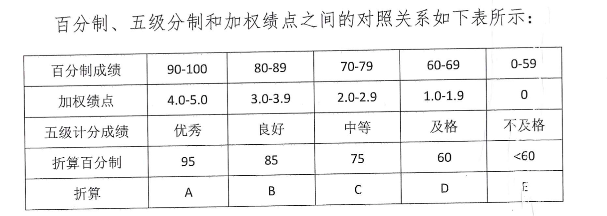

或者这样（来自国内某 985 ）：

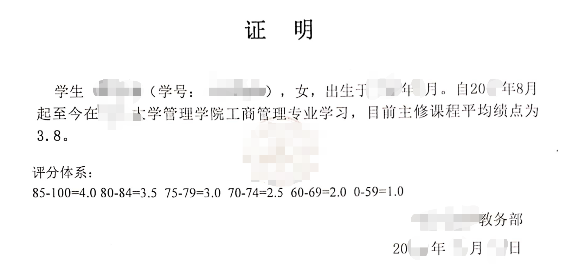

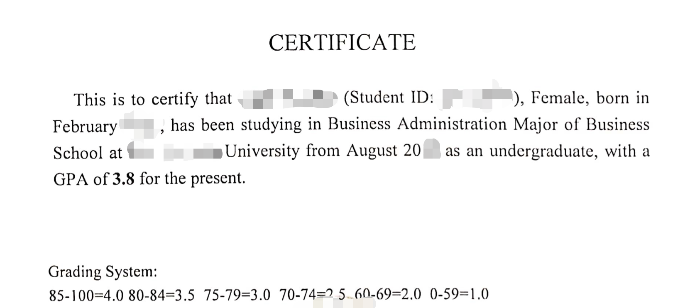

同样还要注意的一点是，成绩单的加权绩点**最好**是百分制，比如 84/100，而不是国内大学常用的 4.0 ，4.3，5.0 制度。有些英国大学，比如 UCL，就特别要求中国学生在申请系统上填写自己的绩点时，填写百分制的成绩。（注意，美国，新加坡，香港，加拿大的学校则没有这个要求。）

（来自 UCL 申请系统）

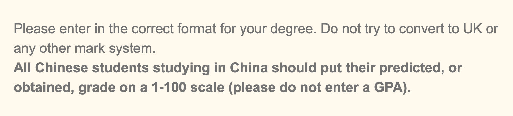

因为英国的大学用的是百分制，他们对百分制有比较天然的倾向。其次招生官需要一个通用的衡量方式来比较不同学分制度下的学生，而在考虑从 4.0 ，4.3，5.0，及百分制中选择一个时，他们选择了百分制。根据经验，绝大部分国内学校的绩点都很容易转换为百分制。

如果成绩单开出来后你发现上面没有百分制，那么可以让学校开具一个百分制证明。

如果你是海外的本科，或者有在国外学校交换，那么学校出具的英文成绩单可以直接使用。（如果你在国外有交换，请把交换成绩单附在你国内成绩单的后面。）

**成绩排名**

成绩排名即你的分数在全班或者全年级的排名。如果你的排名在 20% 以内（相对优秀了），那么可以选择让学校出具一个排名，附在成绩单的后面。也可以在你的简历中写出这个排名，让招生官更清楚你的学术表现。如果排名在 20% 以外，那么可以不写出来，也不附排名证明。

如果你的绩点比较低，但是同时你所在的学校或者专业有比较严重压分现象，那么你可以在申请系统中做出说明，常见的地方是 other information 那一栏，或者说在个人陈述中说明。如果你绩点低，但是排名高，那么也最好让学校开一个排名证明（如果可以，还可以让学校在这个证明上标注一下排名第一的同学的分数是多少。）毕竟口说无凭，有学校的证明还是好一些。

英国、澳洲学校的系统基本不会问你的排名是多少，香港、新加坡、美国和加拿大的部分学校则会问你的排名。

排名证明（来自国内某 985 ）大概是这样：

（来自国内某 985 ）

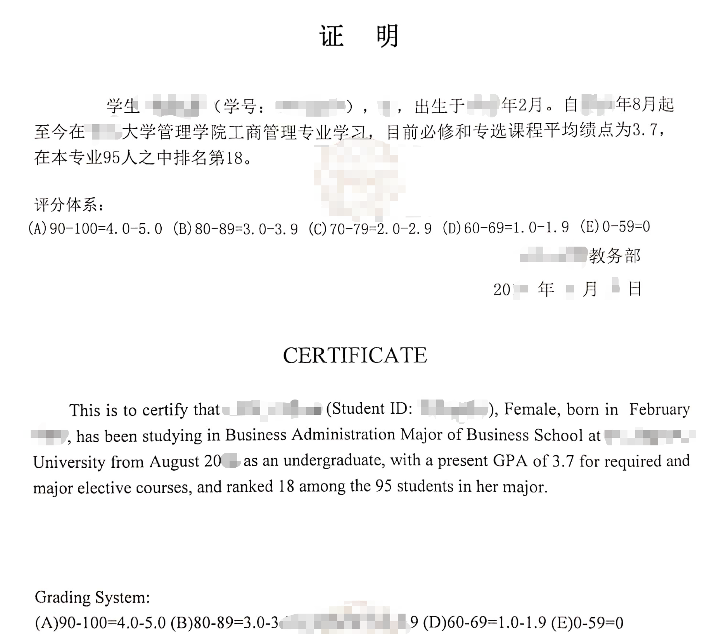

#### 在读证明或者毕业证、学位证 （中英文都要）

如果你申请时尚未毕业，请在学校开具一个在读证明（中英文都要）。如果你申请时已经毕业，那么就需要把学位证、毕业证（中英文都要）扫描成 PDF。

在读证明一般长这样：

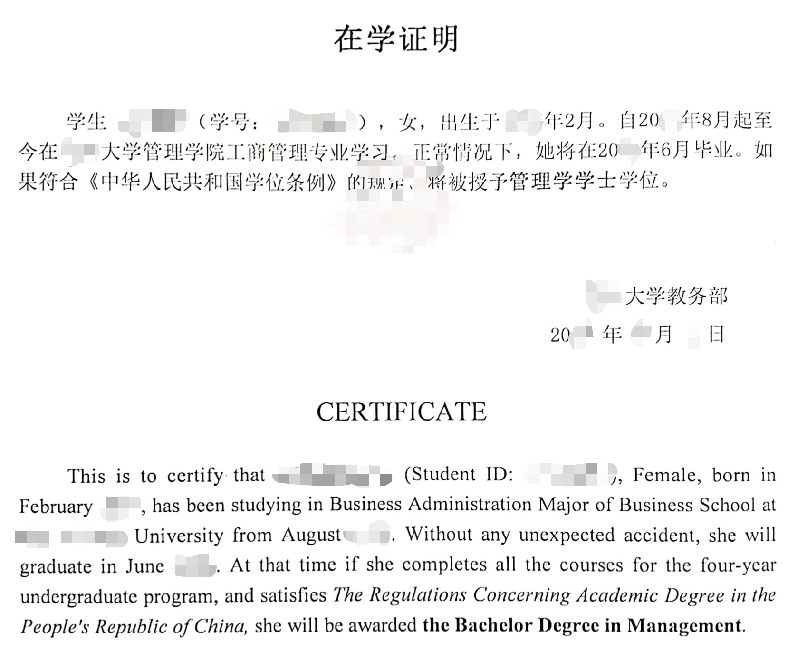

或者这样（来自国内南部某财经大学 ）：

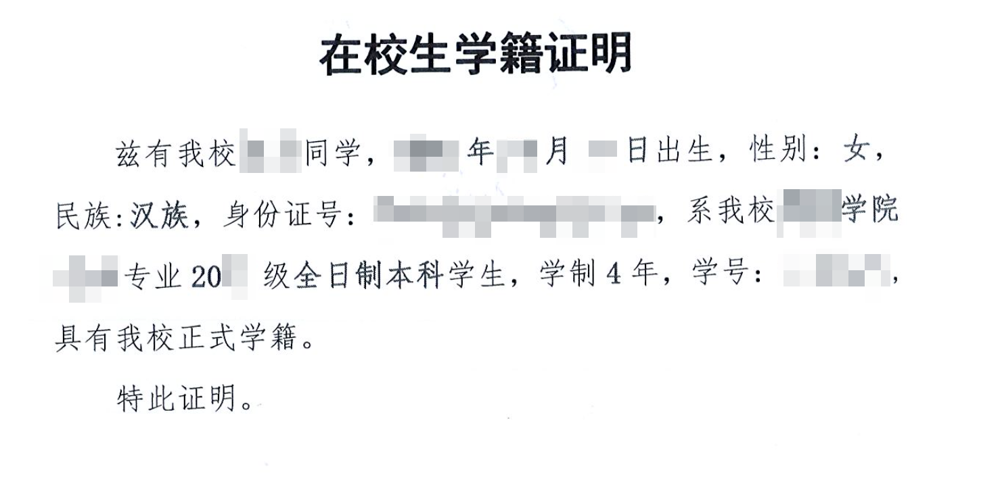

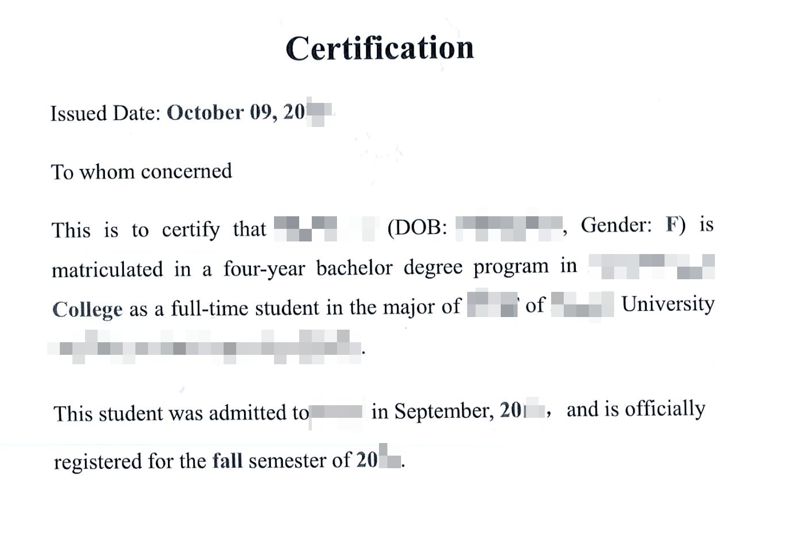

毕业证学位证的翻译版可以参考下面这个：

（来自国内某 985 ）

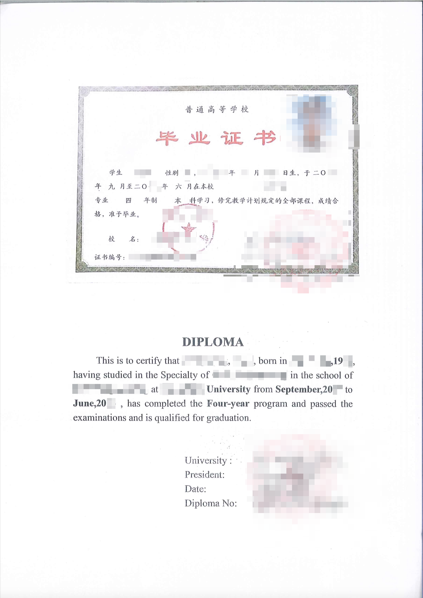

学位证证明大概这样：

（来自国内某 985 ）

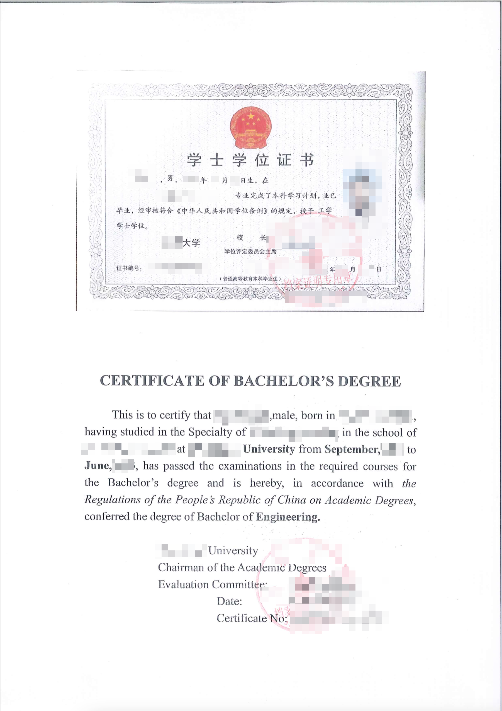

####  英语成绩证明（雅思托福等）、全英文教学证明 （英文）

如果你所在的学校或者院系是全英文授课的，比如国内的一些中外合作学校，或者说香港的大学在国内的分校，那么你可以让学校出具一个全英文教学的证明。一般这些学校都会有现成的证明可以下载或者打印。在申请的时候记得附在成绩单后面（即把这个证明文件的 PDF 和成绩单的 PDF 合并到一起）。

绝大部分英国学校在申请的时候并不需要英语成绩，你可以很放心地不带雅思或者托福成绩申请英国的研究生项目。但是有个时候，如果你在上传英语成绩的那一栏没有上传文件，有的申请系统会显示材料不全。比如爱丁堡大学的申请系统，本来不需要英语成绩的，但是却提醒你文件未上传。有些同学会担心这样会不会导致申请没有被传送到招生官那里去。在下图箭头处我们可以看到，你只需要在申请「成功」后，才需要满足英语成绩。

（来自爱丁堡大学申请系统）

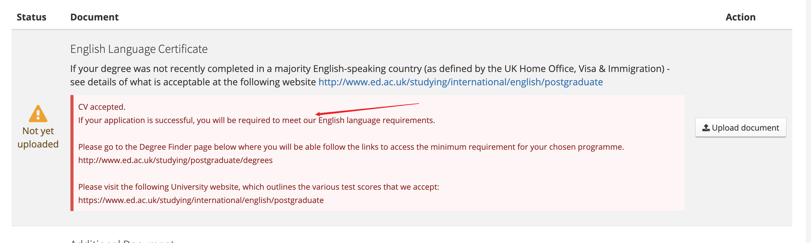

当然为了消除这个大大的惊叹号给同学们带来的可能的忧虑，我们建议上传一个解释文档。你可以这么说：

----

Dear Selection Committee, 

I don’t have English certificates yet. 

I will take an IELTS test to secure the unconditional offer at the appropriate time. 

My forecasted level of English is C1. 

Please proceed with my application. 

Thanks, 

Your name 

-----

你上传这个上去后，系统会显示你已经上传了所有文件，就可以耐心等待 offer 啦。

而对于英国和澳洲之外的学校，你申请的时候是需要英语成绩的。大部分时候，你只需要上传英语成绩的 PDF 即可。美国和加拿大的部分学校可能还会要求你通过考试机构，比如 ETC 或者 British Council 发送英语成绩单到他们学校，那么你根据他们的要求来做就好。

对于英国和澳洲的大学，如果你申请的时候有英语成绩（不管合不合格），我们建议你上传。虽然经验来看，有英语成绩，即使是合格的英语成绩，也不会给你的申请带来显著的加分作用。不过录取是个非常主观的过程，在一定程度上是个概率事件，说不定某个招生官在看你的材料，犹豫不决的时候，看到你的英语成绩，突然觉得这个说明你可以在项目里面很好地学习，然后就录取了你。

#### 简历（英文）

简历可以叫做 resume （也可以拼写成 résumé），在有些地区或者学校也称  CV （全称 curriculum vitae）。

简历在申请中的重要性比较模糊。一方面我们都会比较自然地认为简历展示了一个人的各方面信息，成就和突出能力，自然而然地，简历应该是招生官会主要参考的文件。另一方面，在不少英国大学的官网和申请系统中，简历都不是必须要求的材料，在申请系统里面都找不到上传简历的地方。比如爱丁堡的申请系统就没有上传简历的地方。这也就成了很多中介在申请时没有给学生创作简历的理由。部分项目的招生官不参考简历的理由可能是简历的不可验证性，有些简历可能水分太多，验证起来太麻烦、太复杂。

根据经验，英国的学校中大概有 15% 的申请系统中是没有上传简历的地方的，而大概有 10% 的项目是不需要提交简历的。且我有个大概这样的判断：排名高、竞争激烈、系统更新快的大学都会需要简历。

所以，简历还是我们申请过程中必须准备的材料。对于不需要递交简历的项目，我们仍然建议大家上传简历，这样应该可以略微提高录取率（简历极端空白的情况除外）。如果在申请系统中没有明确的传简历的地方，我们一般建议将简历的 PDF 合并到个人陈述的 PDF 后面，随着个人陈述一起上传。如果申请系统中 个人陈述是一个文字框，无法上传文件，那么也可以和合并到成绩单后面。如果合并到成绩单后，该文件太大无法上传，那么可以上传到其它可以上传文件的地方。比如爱丁堡大学的申请系统没有地方可以上传简历和 PDF 版本的文书，我们建议把简历上传到申请系统最后的文件上传空位；这个空位也许是用来上传其它材料的（比如中文成绩单），没关系，上传就好。

注：爱丁堡大学商学院的大部分项目（除 MBA 外）不要求提交简历，这些项目在申请系统中也没有地方可以提交简历，我们建议把简历和成绩单合并到一起上传。对于爱丁堡大学商学院的 MBA 项目，它的申请系统会出现上传简历的地方。

有些同学可能会问，如果对方不需要申请者上传简历，那就说明对方真的不在乎，我们上传过去，岂不是多此一举，可能还会让对方觉得我们不按照要求来申请？

这样的担心不无道理。事实上，我们提交的所有材料都大概率会经过一个招生办公室的小秘书（以下简称小秘）的检查，这个小秘会把多余的、不相关的材料去掉，减轻招生官的负担。如果项目本身不要求简历，那么上传上去的简历很可能会被过滤掉。当然也有可能小秘觉得这个是比较重要的材料（虽然也不太可能），就没有过滤掉简历；然后简历到了负责录取的老师那里时，如果他觉得简历是多余的，或者比较反感学生上传不要求的材料，那么他就可能（不自觉地）降低给你的打分。也有可能在看到多余的简历后，录取老师就直接放在了一边，并不考虑简历。因为如果其他同学都没有提供简历，而你提供了，且被他们看到了，且被纳入了录取决定之中，那么其实从某种角度来说，这样对其他同学不公平。

因此，关于是否上传简历到不需要简历的项目中去，我们保持开放态度。你可以上传也可以不上传。

有同学可能会希望根据项目来定制简历。比如申请教育的项目就在简历中多突出教育经历，而把其他不相关的经历放在后面或者直接略去，这样可以体现自己对于教育持久的兴趣。这样的想法很好。只不过我也希望提醒一点，这两种情况：「一开始就对教育感兴趣」和「经过多段探索后决定在教育领域深造」，在招生官看来可能是同样合理、有力的动机。所以你如果在各个行业和领域都有经历，也可以考虑都写在简历上。这样做还有一个好处，就是简历上内容更丰富，你能够在个人陈述中提及的经历更多。丰富的经历和尝试也是一个竞争优势，你可以给项目的同学们带来多元性和更加全方位的视角。这可能也是为什么在实践中，我们感觉根据项目来定制简历对大部分同学们来说意义不大。

所以，根据项目来定制简历并不是绝对必要，需要根据情况来判断。需要注意的是，如果项目要求在某方面达到一定的工作年限，那么你一定要把这个考虑进去，适当修改简历来满足这个要求。

**具体要如何撰写简历？**

这个问题恐怕可以写一本书来谈。我觉得在这里，二八定律也同样适用，就是说，20% 的关于简历撰写的知识点可以解决 80% 的简历问题。所以，我在本书中会讲一些大的简历撰写原则，同时提供一两个模板供大家参考。我也鼓励大家多学习简历写作，甚至说专门去上一个课程都不为过。简历撰写是大部分人职业生涯中一直要做的事情，早点把这个技能打磨好，对未来的成长很有帮助。

下面是一个 crash course on resume writing:

1. 简历尽量只用一种字体颜色、一种字体、一个字号，不要使用下划线（分割线是可以的），尽量少使用加粗，斜体等格式（论文的引用除外）。
2. 简历上不用附照片，在英国和北美，简历上带照片是大忌。
3. 简历上不要用图案。
4. 简历上不要有：大大的「CV」或者 「Resume」字眼、出生年月、性别、婚姻状况、国籍、政治面貌……
5. 不要罗列自己的相关课程。如果一定要罗列，列举 3-4 个为最佳。
6. 简历上不用写自我称述（简称自述）。
7. 工作经历描述的第一个单词一定要是动词的过去式，描述经历的时候，多用数字来量化成果和贡献。
8. 按照时间倒序排列经历，即最近的经历在最前，最老的经历在最后。
9. 简历上的货币金额要转换为美元 ，且标注清楚货币符号（如果是申请英国，那么也可以转换为英镑），千万不要用人民币金额。
10. 除非项目明确说明只要一页纸的简历，那么你就不用追求一页纸的简历。你写出来是多长，那就多长吧。
11. 字体 10-12 号，Times New Roman 是最安全的选择。
12. 简历上的邮箱地址最好和你申请时用的地址一致。同时，最好用你的学校邮箱，或者 outlook 邮箱，而不是 qq, 163, gmail, hotmail, foxmail, 126 等等邮箱。这些邮箱「看起来」不专业。

注意，以上建议适用于留学申请，对申请国外的工作也基本适用。

这是英国普遍的简历样式：

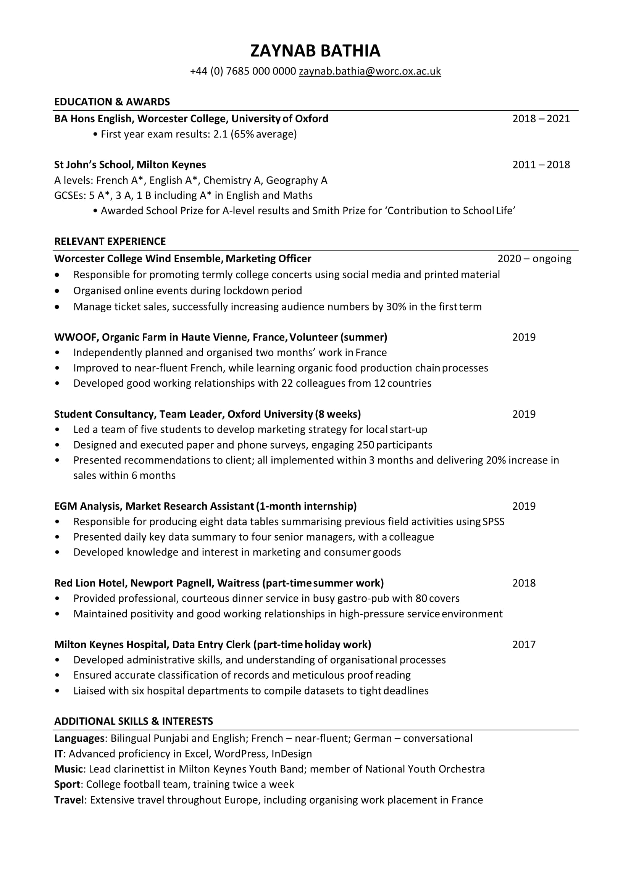

美国的样式：

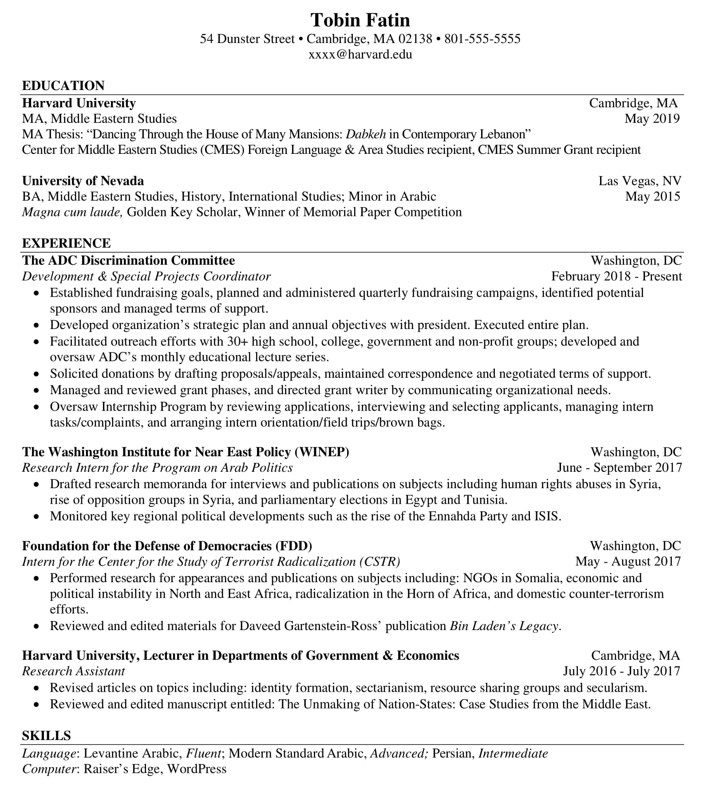

其实，并没有所谓的英国或者美国样式一说。他们两者的区别很小，基本可以通用。如果真的要说一点区别，那就是（据说）美国对于吹嘘自己比较放得开，而英国人相对克制一点。

有两个模板是我感觉相对不错的模板，大家可以下载下来直接使用。

* 帝国理工的 [简历模板](https://www.imperial.ac.uk/media/imperial-college/study/apply/public/CV-template.doc) (doc 文档)

* 哈佛大学的 [简历模板](https://ocs.fas.harvard.edu/files/ocs/files/template_bullet.doc?m=1598221019)

这些大学的就业办公室都提供了很好很权威的简历写作建议，当你发现有些关于简历创作的建议相互冲突时，你应该学会参考它们：

1. [哈佛大学](https://ocs.fas.harvard.edu/guide-template-library)
2. [牛津大学](https://www.careers.ox.ac.uk/cvs#/)
3. [LSE](https://info.lse.ac.uk/current-students/careers/Assets/Documents/application-and-cv-brochure.pdf)

国内有一些简历制作工具也非常好用，我个人觉得挺好用的一款是超级简历 (wondercv)，同学们可以尝试一下。

**关于简历水分**

一般来讲，简历中 10%-30% 的水分是可以接受的。如果你管理的团队是 15 个人，你写了 20 个人，这样问题不大。

但是接下来这一点是我非常不情愿说的。从这么多年的留学咨询和申请经验中，我观察到其实部分同学和中介创作的简历都真的是「创作」，这样诚实的同学反而在某种程度上处在了劣势。做为一个比较现实的理想主义者，我意识到自己难以改变他们。但是至少我可以把这个现象指出来，提醒并不知情的诚实的孩子们。如果你发现简历写出来后很空，没有什么内容和经历，你该怎么做，应该由你自己来把握。

最后，如果你需要简历创作方面的帮助，可以联系北辰光。

#### 个人陈述

个人称述 (personal statement)，也称动机信 (motivation letter)、目的信（statement of purpose），LSE 也称之为 statement of academic purpose。因为它们其实性质基本一致，我们在以下统称为 PS。

如果说简历分量和工作量和一个平常课程小论文相当，那么和 PS 相当的就是毕业论文（设计）。PS 是申请材料中十分重要的、且在我们自己的控制范围内的材料，所以大家一定要认真认真再认真。

在创作 PS 时，我们首先要弄清楚各个项目的要求。我们要明确这些点：

该项目是否需要个人称述？有些项目不需要提交 PS，比如格拉斯哥大学的部分项目（例如：[Intellectual Property & The Digital Economy LLM](https://www.gla.ac.uk/postgraduate/taught/intellectualproperty/)）。对于项目官网没有明确提到需要提交 PS 的，申请的时候可以不交文书。事实证明，我们有几位同学申请格拉斯哥大学的部分项目，没有文书，最后也能够获得 offer。如果你希望递交 PS，也是完全可以的。如果在申请系统里面没有找到专用的地方上传 PS，你可以把 PS 和简历合并到一起上传。我们并没有证据表明，在这种情况下，上传 PS 会给你的申请带来有利或者不利影响。

PS 的字数要求。一般来讲，如果该项目对 PS 没有字数要求，我们推荐写大概 750 words （英文单词），也就是大概用 12 号字，Times New Roman 字体，1 倍行距写一页半左右。同一所学校的不同项目对文书的要求可能都不一样，所以一定要以项目官网的要求为准。有些同学会觉得 PS 越长，越能够体现自己的情真意切和丰富的经历。这个从申请者的角度来说可能是成立的，但是招生官喜欢阅读短的文书。在很多大学的关于 PS 的指导中，招生官一再强调 PS 要言简意赅。所以，如果没有字数要求，那么写 750 字，如果有，那么一定不要超出字数限制。

PS 的内容要求。部分项目对 PS 有明确的项目要求，我们则需要在 PS 中覆盖到这些点。而覆盖的顺序可以由自己控制。对于项目没有明确要求的，我们可以参考该项目所在的大学对 PS 的一般要求。比如华威大学的各个项目对文书其实没有具体的要求，但是华威大学的官网以及部分院系的官网有网页给出了一般性建议可以供我们参考。

PS 格式要求。在部分学校的系统里面，PS 只能以粘贴文字的方式上传（比如爱丁堡大学）；有些只能上传文件（比如牛津剑桥，LSE，帝国理工，KCL等）；还有些两者都可（比如 UCL，杜伦大学，华威大学等）；还有些要求先在项目给出的一个问卷文档里面写好，然后把问卷文档上传到制定的地方或者发送到制定的邮箱地址（比如格拉斯哥大学的一些两年制 [ERASMUS MUNDUS](https://www.gla.ac.uk/postgraduate/erasmusmundus/) 项目）。对于接受 PDF 文件格式的 PS 的学校来说，部分会要求在文档每一页的页眉（header）或者页尾（footer）注明申请者的名字和申请的项目名称。比如 LSE ：

> Have your name and the name of your chosen programme in the header or footer of every page.

效果大概这样：

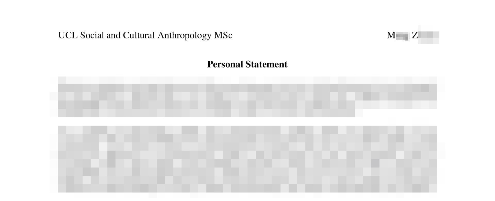

事实上，我们建议所有同学，如果能够上传 PS 的文档，最好都在页眉加上项目名称和名字；同时，在上传的时候，把 Word 转换为 PDF 格式上传，因为同一个 Word 文档在不同的设备和软件中打开的排版可能会不一样，甚至会乱掉，而 PDF 可以很好地保持文档的一致性。另外，上传文件的话，我们也能够在合理范围内突破字数限制。

有些项目的文书要求并不在项目的官网上，而是被汇总在学校的官网上。比如 LSE 和 UCL 的文书要求你可以分别在这两个网页找到。

下面是我整理出来的一些英国大学对文书的要求和对应的网页：

* 剑桥和牛津大学的每一个项目都有文书的详细要求，可以查阅项目官网。比如牛津大学的经济学硕士的要求是：

> Statement of purpose/personal statement:
> A minimum of 500 to a maximum of 1,000 words

* [帝国理工](https://www.imperial.ac.uk/study/pg/apply/selection/) ，一般一页到两页，商学院「建议」一页以内。
* [伦敦政治经济学院（LSE）](https://www.lse.ac.uk/study-at-lse/Graduate/Prospective-students/Supporting-documents/Statement-of-academic-purpose)，一般 1000-1500 字以内，部分项目有特殊要求。这些项目包括：
  * MSc Media and Communications (Data and Society)
  * MSc Media, Communication and Development
  * Global Master's in Management
  * MSc Social Innovation and Entrepreneurship
  * Department of Statistics - MSc Programmes （所有统计学系的项目都有其文书要求）
* [伦敦大学学院（UCL）](https://www.ucl.ac.uk/prospective-students/graduate/taught-degrees/how-apply-step-step-guide/programmes-additional-requirements)，有特殊要求的文书都基本在教育学院里面。一般要求文书在两页以内。根据我们 50+ UCL offer 的经验来看，750 字是合理的长度。

UCL 对文书的一般要求：

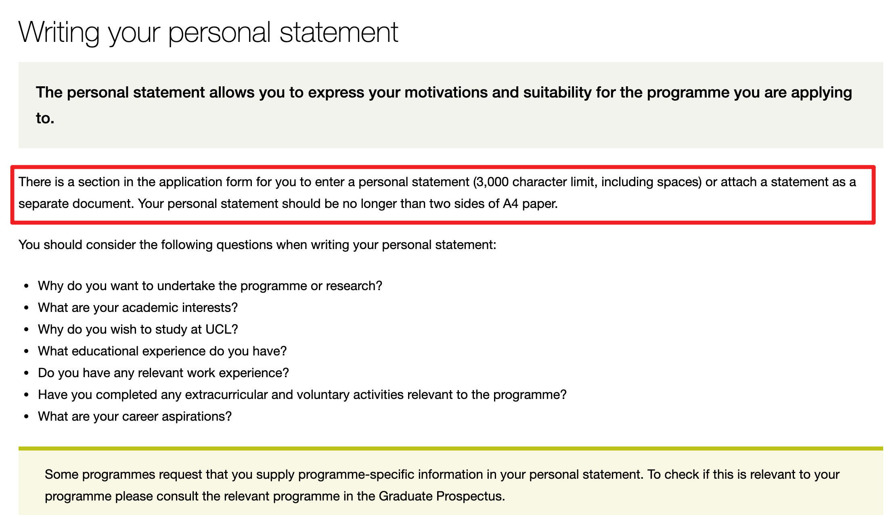

* [爱丁堡大学](https://www.ed.ac.uk/studying/postgraduate/applying/your-application/personal-statement)，要求在 500 以内（ 3500 字符以内）。爱丁堡申请系统有点古板和陈旧 --- 很抱歉这么说，但真的很多学生都感到抓狂 :( 。它官网的文书要求和实际申请系统里面的要求有一点点出入。它的文书其实由两部分组成，除了这个 500 字的主要阐述动机的文书外，它还要求学生描述他们的相关知识、培训和技能 （英文为 Relevant Knowledge/Training Skills，也给了 500 字的限制，见下图）。不管你申请爱丁堡的哪个项目，不管项目是否有自己的明确 PS 要求，这两个都是必须要填写的，否则系统不让提交申请。针对这个，我们建议是按照项目的要求来准备文书，然后上传的时候，把前面 500 字的内容粘贴在第一个空，然后剩下的放在后面的空即可。如果项目没有具体的要求，那么可以按照申请系统里面的要求来做：也就是说，先写 500 字的学术动机，职业发展动机等等，然后后面写 300 字左右的内容说明自己和这个项目的匹配度。注意，爱丁堡大学的申请系统的 PS 上传方式只有这种粘贴文字的方式，不能上传 PS 的 PDF 文件。

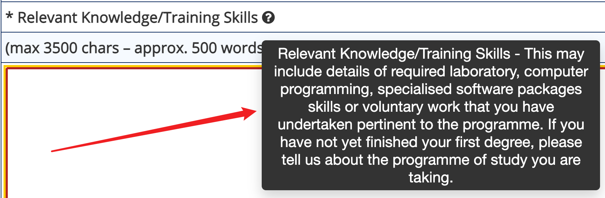

（来自爱丁堡大学申请系统）

* KCL （国王学院，一般他们自己用 King's 作为简称，而不是大家常用的 KCL，所以在文书中，请注意使用 King's）没有提供一般性建议。它的系统允许粘贴文字和上次文档。文书的一般要求为：

>A personal statement is required. This can be entered directly into the online application form (maximum 4,000 characters) or uploaded as an attachment to the online application form (maximum 2 pages).

* 曼彻斯特大学的文书上传方式为上传 PDF 文件。它并没有一个统一的文书要求，也没有给出一般性建议。不过商学院的项目一般会把文书的要求写得非常清楚。比如 MSc Finance：

> Advice to applicants
> Your statement of purpose should cover the areas outlined below and be one page A4: 
>
> Tell us why you are interested in the MSc Finance course at Alliance MBS and how the course will impact on your future
> List any other finance courses or qualifications you have taken in addition to your undergraduate degree
> Describe what makes you an outstanding applicant and describe your potential to contribute to all aspects of the course.

* [华威大学](https://warwick.ac.uk/study/postgraduate/apply/personal-statement/)，要求一般 500-1000 字。可以上传 PDF 或者直接粘贴文字。

* [布里斯托大学](http://www.bristol.ac.uk/study/postgraduate/apply/supporting-documents/)的 PS 同样是上传文件，要求是 1000 字左右。每个项目的 Admissions Statement 也有一些要求，可以从官网下载下来参考。
* 格拉斯哥大学的 PS 同样是上传文件，部分项目不要求 PS，还有一部分有比较明确的 PS 要求。比如 [GLOBAL ECONOMY MSc](https://www.gla.ac.uk/postgraduate/taught/globaleconomy/#tab=entry)：

>You should also submit a personal statement of around 300 words. This should cover
>
>- the degree to which your previous educational and professional experiences and interests make you a suitable candidate for the programme - and how completing the programme will benefit you professionally
>- the motivation for applying for this programme specifically.

* [诺丁汉大学](https://www.nottingham.ac.uk/careers/students/furtherstudy/applying.aspx)的 PS 要求比较不太一样。在申请系统里面，学生有两个上传 PS 的方式：回答系统里面的六个 PS 问题（所有的问题都是必答），或者上传一个 PS 文档。如果选择后者，申请者可以不用管系统里面的 PS 问题。原话是这样的：

>Please complete the questions below or upload a personal statement as a Supporting Document. If you upload a personal statement as a document, you do not need to answers the questions below. Please note that your application will not be considered without a personal statement.

这六个问题分别为：

1. What is your rationale for applying to this course, and why do you think you are a suitable candidate for a place on the course?
2. What elements of the course are you drawn to, what made you choose this particular programme?
3. What previous experience, either practical or academic, do you have that is relevant to the programme you are applying to?
4. What are your future aspirations, either career or academic, and how you see this programme benefitting these aspirations?
5. Please explain and demonstrate your motivation for applying to this course?
6. What attracted you to want to study at the University of Nottingham?

对于诺丁汉的文书，我们的建议是上传 PS 的文档，PS 里面的内容也应该大致回答上面的问题。

其他学校的文书要求我虽然没有一一整理出来，但是大家可以看到，各个学校对于文书的要求都差不太多。对于没有覆盖到的学校，大家可以自行搜寻一下相关信息。

**澳洲文书**

很多澳洲的学校和项目申请时不需要申请人提交 PS 。商学院的项目通常会需要提交 PS，且对 PS 的要求和英国学校类似。

**美国文书**

美国文书的要求和英国相差也不大，只是他们对文书有相对更高的要求。另外，有些项目会要求申请人提交两个文书：Statement of Purpose (SOP) 和 Personal History Statement (PHS)。其中 Personal History Statement 的叫法有几种，包括：[Personal Statement 和 Diversity Statement](https://graduate.universityofcalifornia.edu/admissions/applying/personal-statement/index.html)。其中 SOP 主要是关于学术研究和学习，职业规划等内容，PHS 主要是关于申请人的个人经历，故事等内容。在创作的时候，应该尽量避免两个文书中出现重复的内容。一般来说，两个文书每个大概 500-600 字左右即可。（具体要看学校和项目的要求。）

除了 SOP 和 PHS 之外，美国的一些项目还会要求学生完成一两个命题作文。具体请查看项目官网的要求。

关于 SOP 和 PHS，加州大学伯克利分校有简短的教程，非常权威，值得参考。可以点击这里了解：[SOP](https://grad.berkeley.edu/admissions/apply/statement-purpose/), [PHS](https://grad.berkeley.edu/admissions/apply/personal-statement/) 。

在一个申请季中，基本可以默认每个项目都需要写至少一份文书。如果我们申请八个项目，那么我们要怎么写文书呢？我的建议是相同专业方向的 PS 可以先写一个通用 PS，然后根据学校和项目的具体情况做一定的定制。如果是完全不同的专业方向，那么就需要写一篇几乎全新的 PS。

下面我给一个基于我接近 500+ 文书的经历总结出来的 crash course on personal statment writing：

1. 不要重复自己在哪个学校读书，学习什么专业（不要一上来就说 As a student at XXX univeristy, majoring in XXX），更不要说，Hello, my name is XXX. 

2. 不要把自己的生平都写进去，不要把自己大学以来做的所有事情都写进去，不要重复简历和成绩单中的内容。

3. 不要说自己从小就喜欢 XXX。

4. 不要说选择一个学校是因为它的排名好，声誉好，有「三冠认证」等。这样显得太敷衍，不够有说服力。你可以说一下哪个课程，哪个项目，哪个教授最吸引你。

5. 避免陈词滥调，尽量避免在文章开头引用他人话语（在文末或者文中适当的地方引用是可以接受的），一定不要使用这个句式：Ever since I was a child ... 

6. 使用缩写时，一定要给读者足够的解释和说明。如果你要用 MCN 那么你应该在 MCN 第一次出现的时候在后面补上完整的表达，比如：

   > MCN (Multi-channel network) marketing was the key to the company's success。

   如果你想用你学校的简称，比如你想说 PKU 而不是每次都打全 Peking University，你可以这样：

   > My study at Peking University (PKU) was a memoriable experience. As you know, PKU is perhaps the best university in mainland China ...

7. 文书中一定要包括的内容（项目有明确要求的除外）：

   1. 为什么选择这个专业、项目？
   2. 为什么选择这个学校？
   3. 你的背景和这个项目匹配吗？
   4. 毕业后你的职业规划是什么样的？
   5. 如果你的平均绩点低，但是总体看起来有一个上升趋势（一直在进步），那么也可以在文书里面写出来。招生官会将这个纳入考量。
   6. 比起其他申请者，你的优势和独特之处是什么？

8. 每个段落要有一个 topic sentence 来总领整个段落，每个段落不要太长（比如半页 A4 纸，），也不要少于三句话。正常来说，一页 A4 纸应该有 4 个或以上段落才会读起来比较舒服。

9. 短句子胜过长句子。

10. 涉及到人民币金额时一定要转换为该学校所在国的货币金额，或者统一用美元。（如果你在申请一个关于加密货币的项目，那么用比特币、狗狗币等可能会合适。）

11. 如果你的简历上有显示出你有一年或以上的学习或者工作的间隔（比如你从大二是 2018 年结束了，但是在 2019 年你才开始大三），那么在文书中一定要做出相应的解释。

12. PS 应该有一个完整的框架，明确的开头、主体、和结尾。

13. 一定要注意中文标点和英文标点的区别。在英文中出现中文标点是很让人不舒服的，反之亦然！

14. 你不需要有 native speaker 的语言功底也能够写出非常动人的 PS。

15. 如果你找中介或者他人帮你写，你一定要注意把控质量，以及检查他们是否有抄袭嫌疑。如果你交上去的 PS 有抄袭嫌疑，国外学校会直接拒绝你的申请，且可能会把你的申请列出黑名单。

写作 PS 的基本技能是英语写作，所以你也可以趁此机会，好好学习一下英文写作。在这里，我想推荐三本英文写作的「圣经」。其中  The Elements of Style, by William Strunk Jr. 和 On Writing Well, by William Zinsser 这两本书在英美大学被普遍用做教科书和标准参考书。几乎每一个老师都会听说过、读过、推荐过这几本书。还有就是经济学人的 Style Guide 也非常值得一读。如果你能够把这三本书好好读完且应用他们建议的写作原则方法到你自己的写作中去，我相信你的写作能力将会在绝大多数人之上。

最后，北辰光提供免费的文书打分服务，大家可以尽情把文书扔到我们的客服邮箱哦。如果你需要 PS 创作方面的帮助，可以联系北辰光的文书团队。

#### 推荐信（英文）

推荐信的英文表达有几种：Reference Letter，Recommendation Letter, 和 Letter of Recommendation。帮忙做推荐的人叫做 referee。

每个项目要求的推荐信数量并不一样。有些项目要求两封，有一些一封，有些甚至不需要。所以我们要看清楚。这个的话，我们在前面一步已经统计好了，所以我们这个时候就很清楚自己需要找多少个推荐人，以及每个推荐人需要帮忙递交几封推荐信了。一般来讲，对于英国、新加坡、欧洲、香港申请，我们建议找至少两个推荐人，对于北美的申请，我们建议找至少三个推荐人。

在中国，推荐人普遍能够接受这种做法：申请人自己先写一个推荐信的初稿，推荐人看过、修改过后在上面签字。事实上，大部分中国大学的老师也是这么做的。这也就意味着申请人可以在一定程度上影响、甚至控制推荐信的语气和内容。这一点在后面我会再详细阐述。

**推荐信的类别**

1.	学术类（由学校的老师提供的推荐信，简称A类， academic）
2.	企业类（由所在公司或者社会机构所雇佣的个人提供的推荐信，简称B类，business）

如果你毕业超过两年，或者申请偏就业、职业发展类的专业，可以是一封学术类推荐信加一封企业类推荐信，即 A+B。如果是毕业太久，找学校老师不方便，那么 B+B 也是可以的。一般我们推荐前者，这样能够更全面地反应你的能力。
如果你毕业不到两年，或者尚未毕业，推荐A+A，或者A+B。如果是比较理论型的课程，可以选择前者，如果是比较偏技术应用型的，可以选择后者。

**推荐人的选择**
总体来说，最合适的推荐人是应该符合以下条件（按照重要性降序）：

1.	认识你比较久，同时和你有多个场合的交集，且能够给予你正面评价
2.	这个人的头衔，教授 > 副教授 > 讲师 *；直系领导 > 大领导 > CEO 
*注意：申请国外的研究生，讲师出具的推荐信是完全可以接受的，国外的本科授课很多是由讲师完成。（部分香港的大学会要求推荐信老师的头衔在副教授以上。）

很多同学认为推荐人的头衔越高越好，哪怕和自己从来没有说过话。但是推荐信又需要言之有物，所以如果推荐人让你自己写推荐信初稿的话，那么你就需要自己补充一些内容来让该推荐人对你的支持有理有据。这个时候你需要自己估计好你写的推荐信的内容能不能被推荐人所接受。一般这些教授，院长，CEO 都会比较重视自己的声誉，并不会给与太多的通融空间。

而如果对方并不接受学生写推荐信这个做法，那么他很可能会拒绝你的邀请，因为他不认识你；如果他接受了你的邀请，成为你的推荐人，那么他写的推荐信恐怕不会是最理想的，因为他只能从你的成绩单，你的简历来基本判断你的情况，写一些模棱两可，非常宽泛的评价。

不过真实情况是，对于中国的老师，他们很多都会愿意让学生写推荐信初稿，然后对其内容也不会太关心。所以如果你觉得你可以找一个头衔高的，可以让你在推荐信内容方面有足够发挥空间的推荐人，那也是可行的。

有同学问：

工作上的推荐信可以找同事写吗？学校那边会打电话背调吗？

答：

基本不会。所以可以找同事写推荐信，但是要“写成”是领导的。

**推荐信的上传方式**

不同的学校的申请系统有不同，因而上传推荐信的方式也不同。不过基本可以分为三种情况：

1.	申请学校发送邮件到推荐人邮箱，由邮件接收者点击邮件里面的链接来上传推荐信，包括有牛津大学，剑桥大学，帝国理工，LSE，约克大学，华威大学，UCL等。此处也分三种情况：
   1.	学校允许推荐人直接上传已经准备好的推荐信文件，不需要做其他动作 
   2.	学校要求推荐人填写一个网页版的推荐信问卷，然后提交 
   3.	学校要求推荐人填写一个网页版的推荐信问卷，并且提交准备好的推荐信文件，然后提交
2.	申请者可以直接上传已经准备好的推荐信文件到申请系统 （爱丁堡大学，格拉斯哥大学，曼彻斯特大学，伯明翰大学，诺丁汉大学，南安普顿大学，布里斯托大学，杜伦大学，莱斯特大学等）
3.	还有一类情况是，学校要求推荐人自己把准备好的推荐信通过他们自己的邮箱发送给学校相应的录取办公室。比如曼彻斯特大学。虽然它的系统也允许申请者直接上传推荐信，但是对于一些不愿意让申请人看到推荐信的推荐人来说，让他们直接发送到学校是最合适的。对于曼大的推荐信，我们首先要从它的官网下载一个推荐信的 [表格](http://documents.manchester.ac.uk/display.aspx?DocID=9150)，然后填写好自己的申请信息后给到推荐人，并告诉他完成并发送这个表格到制定的邮箱地址。根据经验，曼大的推荐信，可以不用下载这个表格，直接用自己准备好的推荐信上传到系统里面去就行。我们这样的成功案例。新加坡国立大学 （NUS）的部分专业的推荐信也是通过这个方式来发送的。

第二种情况是最方便的。第一种会给老师带来额外的工作量，所以我们一般让老师收到推荐信的邀请邮件后直接转发到学生的申请邮箱，由学生（或者其中介）来完成推荐信的上传工作。大部分老师是愿意配合的。

下图是 UCL 发给推荐人的推荐信邀请邮件。注意到下面有一个链接，通过这个链接，推荐人（或者学生、中介）可以提交推荐信。

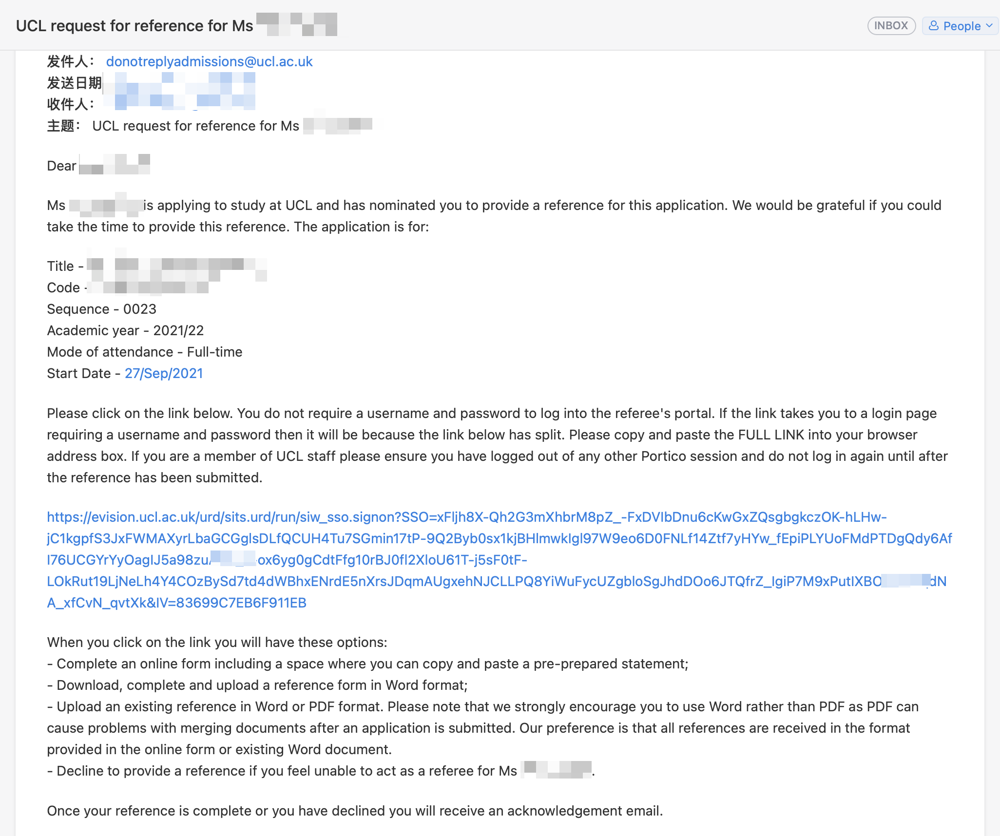

**推荐人联系方式要求**

邮箱

一般是最推荐使用推荐人所在机构的官方邮箱。比如如果是北京大学的老师，那么最好用以 @pku.edu.cn 结尾的邮箱地址；如果是百度的领导写推荐信，那么最好是用他的 @baidu.com 结尾的邮箱地址。如果因为各种原因没有，那么可以考虑使用私人邮箱，比如 163，126，QQ，Hotmail，Gmail，Outlook 之类。根据经验，剑桥，牛津，帝国理工，LSE 对这个邮箱要求较高，尽量要使用机构邮箱，而 UCL 则要求较松，我们很多申请用的私人邮箱也获得录取。

使用机构邮箱的一个重要目的就是确认推荐人的身份。如果是正规高校的老师，那么他肯定会有一个大学官方域名结尾的邮箱账号。而这些邮箱账号是几乎不可能伪造的，所以这也就从侧面证实了推荐人确实是在这个机构工作。而如果老师的联系方式填的是私人邮箱，则起不到这个效果。这也给了部分同学一些机会。他们可以在没有联系老师的情况下，填上自己注册的邮箱，伪造一个推荐信。有意思的是，我们有一位这样的同学最后拿到了格拉斯哥大学的录取。（可以推测，推荐信在一些专业的录取中并不重要。）

电话

极少数情况下学校会通过电话联系推荐人。在填写推荐人的信息的时候，电话一栏经常是必填的。我们建议填写推荐人的工作电话，固定电话，而不是私人电话。因为固定电话也显得更加官方，正式。有同学可能会担心，老师不一定时长在办公室，固定电话经常会漏接，万一招生官打电话过来没有接到怎么办？这个没有关系的，一般打电话的不是招生官，而是招生办公室的秘书，如果一次没有打通，他们通常会多打几次。同时，他们也很清楚，老师也有自己的事情要忙，不可能一直守在电话旁。

如果老师同意，你也可以填写私人电话。

在这点上，大家不用纠结，老师给哪个，就用哪个好了。

**推荐信其他要求**
一般英国学校要求推荐信上注明日期。同时，日期须在一年以内（少部分学校允许两年）。比如，如果你在2021年10月1日申请，那么这个推荐信需要是在2020年10月1日之后出具的。

对于可以直接上传推荐信扫描件的申请系统，推荐信需要用单位的抬头纸打印出来，签字，然后扫描。
可以用Word版本的抬头纸文件写推荐信，可以电子签名（从而跳过打印和扫描步骤）。这样出具的推荐信是完全有效的。
如果没有抬头纸，可以自己做。（本书的附件列表中有抬头纸的模板可以下载。）

下图是一个比较标准的推荐信样式，大家可以仿照着准备推荐信。

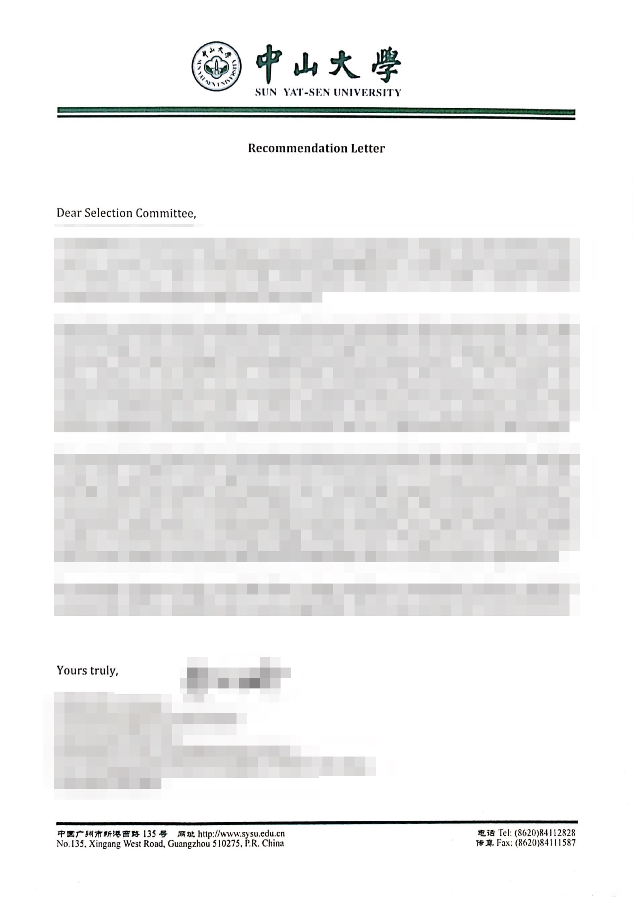

现在我们来讲一讲推荐信的内容。同样，我给一个 crash course on reference letter writing：

1. 推荐信不宜过长，最好最好控制在一页以内，也就是英文大概300-400字的样子。
2. 称呼避免使用 To Whom It May Concern, 以及 Dear Sir/Madam 这样的称呼。用 Dear Review Committee, Admission Committee, Selection Committee 是最合适的。
3. 第一段介绍自己和申请人的关系，相识多久，在什么场合相识。给一个对申请人的总体评价（比如在全班同学中属于前 10% 还是前 5% 呢），然后例举他的 2-3 个突出优点。
4. 第二段，第三段以这几个优点的总述性句子开头。然后用具体的事例阐述自己从哪些事情和细节中看出申请人有这些优点。
5. 最后一段总结全文，表示该申请人很适合这个研究生项目的学习，推荐招生委员会录取该学生。
6. 内容一定要有具体的事例做支撑，不能泛泛而谈。尽量少说学生上课按时到，按时完成作业，认真听讲，参与课堂互动等并不能说明学生能力的称述。
7. 在给学生做排名的时候，比如说学生是 全年级前 5% 的学生，可以综合考虑学生的情况，而不是只能用成绩排名。比如，如果一个学生的成绩排名只有全年级 15% ，那么推荐人依旧可以说：在他的评价中，该学生可以排 10%，因为这个学生虽然成绩不到 10%，但是他的积极性，他的其他方面能力很突出。整体来看， 10% 是个更加考虑全面的评价。
8. 推荐信上面一定要有推荐人的联系方式，包括电话、邮箱地址、工作地址，推荐人的头衔，推荐人所在的单位。
9. 推荐信上面一定要有日期，可以在写推荐信的时候就把日期写在前面一点，这样推荐信能够用更久。推荐信也一定要推荐人的签名，中英文都可以，也可以电子签名。推荐信要印在抬头纸上，没有抬头纸可以自己做一个。
10. 如果你的推荐信没有做到上面的某几条，影响不会很大。但是下面的不行：
11. 注意，如果你需要给两个或以上老师写推荐信，请注意一定要在这些信中使用不同的内容，相对不一样的结构，用词和行文风格。这样避免招生官看出这些推荐信都是一个人写的。如果你找中介或者其他人帮你写，你一定要注意提醒他们，同时也自己把控下这个点。

**网推**

对于那些要求推荐人根据链接提供推荐信的学校来说，一般点进去链接之后，系统会要求推荐人填写一个问卷。基本上他们会把推荐信要求的内容做成一个个问题，然后让推荐人回答。比如它会问：你什么时候认识该申请人的？像这样的问题，如果你有按照我之前说的来准备推荐信，你的推荐信里面已经包括了这些内容，复制过来，稍作调整即可。

系统一般也会问，推荐人和申请者是什么关系。这个时候一般会有几个选择：academic, professional, academic and professional。如果是学校认识的，那么填 academic, 如果是工作的领导，在工作认识的，那么填 professional， 如果是学校的老师，指导你的实习，那么可以选择第三个。

有些系统也会让推荐人给申请者的各项能力打分。比如下图的曼彻斯特的推荐信表格。我知道我可能在废话，但是大家一定要谨慎把所有的方面都「拉满」，也就是所有能力都给最高分。如果你老师确实认为这样，那没有问题。如果你是自己在填的话，请注意这点。

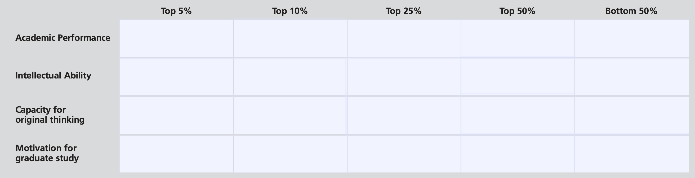

不少时候，学校给推荐人发送的推荐信会被邮件软件归类到垃圾箱里面去。如果你的推荐人说没有收到学校发的邮件，那么让他们检查一下垃圾箱。如果还是没有收到，那么你可以通过申请系统，重新给推荐人发送一次邀请；你也可以修改推荐人的邮箱地址，或者换一个推荐人。在你帮推荐人填写完成推荐信递交后，推荐人的邮箱还会收到一封回执邮件，告诉推荐人推荐信已经上传成功。这封邮件可以不用转发给你。

有些对计算机科学比较了解的同学可能有这样的疑问：如果我用自己递交申请时的电脑帮推荐人填写推荐信，那么国外学校会不会发现所有的活动是来自于同一个设备，同一个 IP 地址，然后怀疑这个申请有舞弊嫌疑？说实话，我们不知道。我只能说，根据经验，我们这样做过，并没有出现问题。如果你想要保险一点，那么可以换台电脑，用手机的 WIFI 热点完成推荐信的上传操作。对于更懂计算机的同学，你们也可以挂代理，用虚拟机等。

#### 实习、工作、奖学金、证书、荣誉等证明

很少有英国大学在申请的时候会需要这些材料。你可以放心地默认你不需要提交这些材料。（部分美国学校会要求提供奖学金和荣誉证书的证明，这个时候也最好自己翻译一下）

对于英国大学，不需要这些证明不意味着你可以在简历和个人陈述里面尽情地「灌水」。我们承认，在申请过程中合理适度地「放大」学生的成就能够给学生安全地带来优势，增加录取机会。但是请不要过度。

总的来说，我们在准备材料的时候一定要细心，且尽可能地要求材料符合规范，体现出我们做事的专业性。我认为要做到以下几点：

1. 扫描件要清晰可见且规整。用手机的扫描软件来扫描是可以的，但是一定要保证清晰度，纸张要铺平，尽可能接近扫描机的效果。最后生成的文件不能有水印，文件保存为 PDF 格式。
2. 同一个 PDF 文件中，每一页的方向要一致。最好都是正常的书本的方向 （portrait），而不是横过来 （landscape）。（ LSE 明确要求如此。）
3. 同一个 PDF 文件中如果有多个类型的材料，要按照材料的相关性和重要性从高到低排列。比如你的成绩单的 PDF 中可能包括了中英文成绩单，中英文绩点说明，中英文成绩排名，以及你的交换学期成绩单。那么可以按照这个顺序来排列：英文成绩单，英文绩点说明，交换成绩单，英文成绩排名，中文成绩单，中文成绩说明，中文成绩排名。

本章节最后会有一个简单的文档处理教程，帮助大家实现上面提到的要求。

#### 信息表

根据我们的经验，在申请多个项目的时候，很多信息会重复用到，比如自己的护照号码、学校的英文名、住址等都需要重复填写。如果我们把这些信息提前汇总好，放到一个文档里面，那么每次需要填写的时候，直接复制粘贴即可，可以省下很多时间，也降低出错的概率。

我把我们内部使用的表格上传到了本书附带的网站里面，请大家自由下载使用。

### 2.2 特殊材料

有的项目可能会需要申请者提交其它材料，如果你申请的项目不需要这些材料，那么可以选择跳过这部分。

#### Writing Sample （也称 written work）

比如 UCL 的法学硕士需要 written work，牛津大学和剑桥大学的申请也是有八九需要 writing sample （简称 WS）。通常，研究型硕士可能会需要 WS。通过这些材料，招生官希望能够看到你的写作能力，批判性思维能力，学术研究能力等等。一般来说，最好是自己写过的比较好的论文即可；如果你本科没有写过论文，或者觉得没有写好，那么也可以重新创作一篇。

有些 WS 对字数有严格要求。往往你可以修改一下自己的论文，或者截取其中一段上传即可。比如牛津大学就允许这样的做法。此时，我们建议，如果你的论文过长，可以选择你觉得最精彩，最能体现你能力的部分出来，不一定是文献综述，不一定要是有完整结构的全文。

WS 也要注意有严格规范的学术引用，使用你的论文所在学科一般引用格式，同时尽量多引用英语论文，发表在国际期刊的论文。我看到很多国内同学的论文大量使用中文文献，这其实是不建议的（当然如果你的内容是和汉语、中国社会、文化等有关的就另当别论）。

#### Research Proposal （简称 RP）

RP 也叫研究提案、开题报告、选题报告、研究计划。我认为研究提案这个说法更加符合英文直接翻译过来的意思，也更符合实际情况。所以我接下来会用研究提案做为 RP 的中文翻译。

研究提案大致就是研究者在开始实际研究之前做的准备和计划工作的纸面呈现。RP 需要列出具体的研究问题（research question），文献综述，研究方法，研究意义，创新点，研究时间安排，和引用文献等。通常研究型硕士申请时需要提交研究提案，招生官要求 RP 的目的主要是两层：1）从你的研究提案来判断你对要研究的领域是否有足够的了解，以及通过这个提案来看你的学术研究能力；2）因为他们需要给你指派一个适合的导师，所以研究提案可以让该学校的老师们更好地决定是否成为你的导师。

在创作你的 RP 之前，一定要弄清楚申请是否需要 RP ，以及是否需要你提前联系导师。如果需要提前联系导师，那么你可能会希望根据导师来定制 RP 。

关于如何创作 RP，这些学校的教程可以参考：[爱丁堡大学](https://www.ed.ac.uk/files/imports/fileManager/HowToWriteProposal090415.pdf)，[UCL](https://www.ucl.ac.uk/ioe-writing-centre/plan-your-assignment/write-a-research-proposal)，[曼彻斯特大学](https://www.manchester.ac.uk/study/postgraduate-research/admissions/how-to-apply/research-proposal/)。其中爱丁堡的教程非常实用。

### Another personal statement

有个时候，在你提交了申请之后，即使你在那时已经附上了个人陈述，招生官可能还会发邮件给你要求你重新写一个个人陈述。这个时候邮件里面一般还会附上他们要求的 PS 内容或者其它要求。比如爱丁堡大学 2020 年新开的项目 [Intermediality: Literature, Film and the Arts in Dialogue MSc](https://www.ed.ac.uk/studying/postgraduate/degrees/index.php?r=site/view&edition=2020&id=987) 就在我们一位学生带文书递交申请后，要求他用一个新的模板提供新的文书。

爱丁堡该项目附加的文书要求：

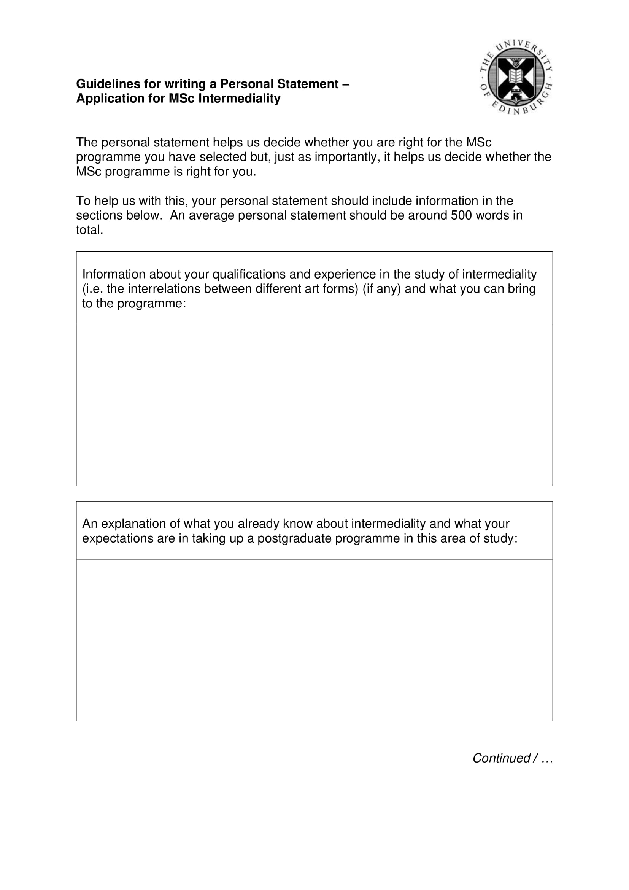

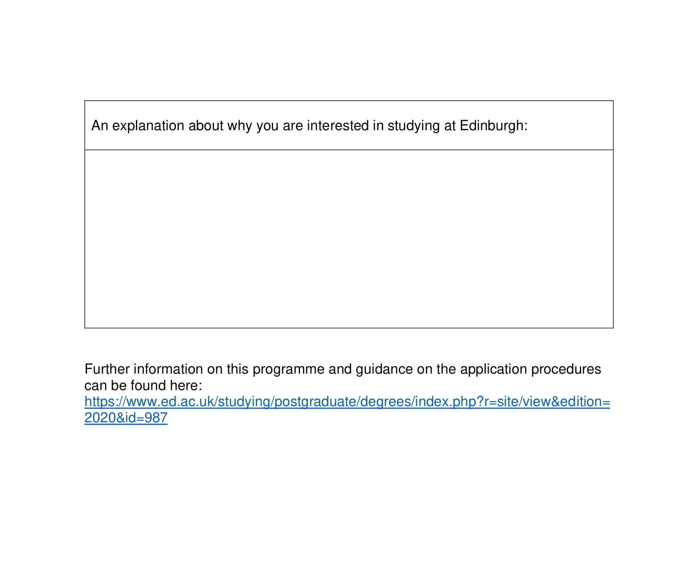

再比如，有的时候，在学生提交申请后，华威大学会明确指出学生的文书不符合要求，要求学生用视频的方式重新补充一份文书。

华威大学的邮件，要求学生补充视频文书：

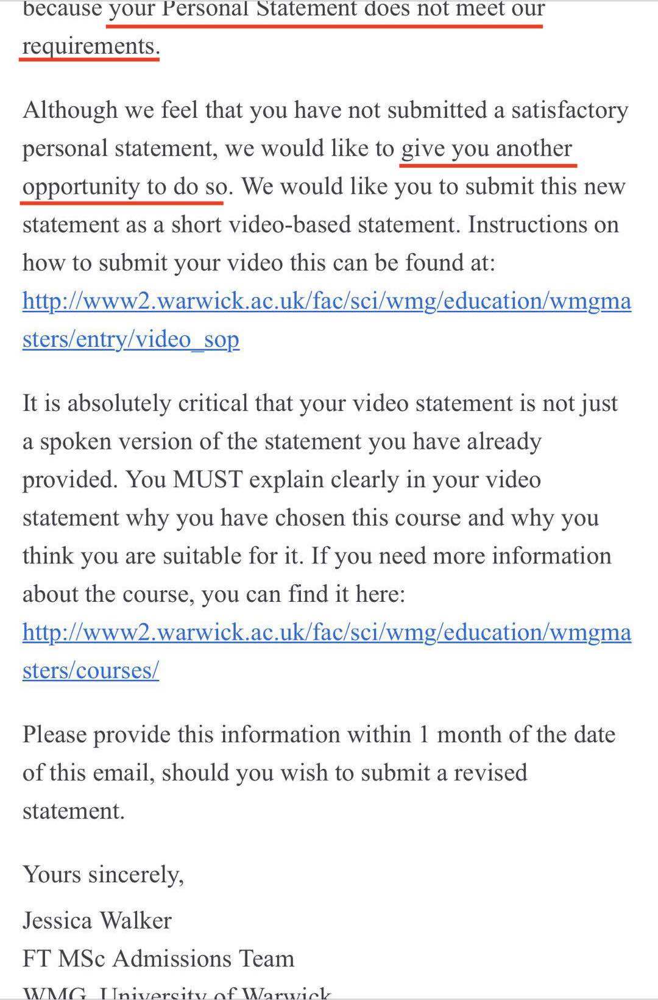

尽管这种情况会发生，但是次数极少，所以大家可以基本上不用担心。如果你按照我前面的文书要求准备文书，你的文书就是绝对是合格的。事实上，爱丁堡这个项目需要补充文书的主要原因是它是一个新的项目，对文书的要求是后面才出来的，学生在申请的时候并没有看到。且补充文书的要求和学生准备的文书本身并没有很大的出入，把原来的文书稍作修改即可。后来学生拿到了录取。而华威大学这个情况更多是中介在帮学生申请的时候，用了模板文书，或者说甚至帮学生传错了文书导致的。

总的来说，只要你按照我的要求去准备文书，你基本上就不用担心申请后学校还要你补充文书的情况发生。

#### Portfolio

艺术、建筑类的项目普遍会需要学生提交 Portfolio （作品集）来了解申请人在该领域的潜力。

所以，如果你申请的项目需要作品集，请一定按照项目的要求来准备。

#### WES 认证（北美的大学需要）

所谓 WES 认证就是一个美国的机构对全球的大学学位和成绩单做验证和评估，判断全球其他地区的学位是否相当于美国的大学学位，以及成绩的换算。北美的部分大学会要求不是美国本科的申请者提供 WES 认证。这个事项的话，网络上有很多指南和教程，在此就不赘述了。

#### 学信网认证（香港的大学需要）

如果是国内本科毕业的同学申请香港的大学，大概率还会需要提交学信网的学历学位认证。需要注意的是，中外合作办学的学校或者本科项目一般也需要提供这个。北辰光有一位西交利物浦的同学，毕业时有英国利物浦的成绩单和学位证明，仍然被香港中文大学要求递交这个认证。这个证明比较容易开，费用低。

小部分欧洲的大学也会需要这个材料，比如法国的 HEC Paris，瑞士的洛桑大学等，建议大家在第一步选校的时候就查好申请需要的材料。

### 2.3 一些基本的文档处理操作

在申请时我们会遇到各种对于申请材料的要求。有些学校要求文件大小不超过 2MB ，有些要求将同类型的文件整合到一个文件。这些操作设计到一些比较基本的 IT 技能，如果大家不会的话，会需要花很多时间精力去弄。所以在这里我给大家一些简单的技巧，可以给大家节省很多时间，并且让申请材料符合要求，最大化录取率。

**Word 转 PDF**

这个是一个常用的操作，在 Word 软件里面就能完成。具体可以百度。

在递交申请的时候，请注意尽量将所有的文件都统一成 PDF 格式，这样文件的排版能够得到保存，也方便招生办的工作人员合并、打印文件。

尤其需要注意的是，文书和简历都要是 PDF 版本的。有些学校的系统里面，文书只能复制文字进去，那就没有办法。其他的时候，一定要选择 PDF，这样会更好。

**图片转 PDF**

工具：

[JPG转PDF – 在线转换JPG图片至PDF格式 (jpg2pdf.com)](https://jpg2pdf.com/zh/)

很多时候我们在打印店扫描出来的文件都会是图片，而申请最好是使用 PDF 文件。我们可以让打印店的员工帮忙转成 PDF，也可以自己通过这个工具转换。 

如果图片格式不是 jpg，这个工具还可以选择其他图片格式。同样地，它也可以把 PDF 转换成我们所需要的图片格式。

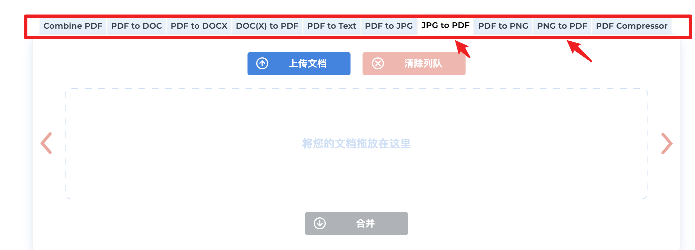

**合并 PDF**

免费工具：

[合并 PDF – PDF在线合软件 (combinepdf.com)](https://combinepdf.com/zh/)

把要合并的 PDF 文件上传上去，可以拖动调整先后顺序，合并后下载即可。

**去掉 PDF 中的一页或者多页**

工具：

[Remove pages from a PDF online (ilovepdf.com)](https://www.ilovepdf.com/remove-pages)

有个时候，PDF 文件中可能有一些空白页或者重复的页面，这个时候我们可以用这个工具去除这些多余页面。

**文件压缩 **

[PDF压缩 – 在线压缩PDF文档 (pdfcompressor.com)](https://pdfcompressor.com/zh/)

绝大部分学校不允许单个文件超过 5MB，一般最好把文件控制在 2 MB 以内。这时候我们就需要用到 PDF 压缩工具。这个在线工具可以很好地完成这个操作，且可以选择压缩的程度。

对于香港科技大学的申请，大家要注意的是，它的申请系统要求所有文件的大小加起来不超过 5MB，而不是单个不超过 5MB。

**抬头纸制作**

对于需要上传 PDF 推荐信的申请系统来说，推荐信最好是打印在学校或者公司的抬头纸上面的。一般来讲，这个抬头纸可以在学校的小卖部买到（不过得说明一下，在小卖部买的带学校 logo 的纸严格来讲并不是官方的抬头纸，不过国外学校不会分得那么清楚），公司的话一般也很容易获得。如果学校和公司确实没有抬头纸，也可以自己做一个。这里我提供了一个模板供大家参考，大家把相应的logo，通讯地址等信息填进去即可。模板可以在[这里](https://github.com/zhoubeichen20/study-abroad-files)获取。

 **修改 PDF （推荐信）**

有的时候，推荐人给你写过一个推荐信，不过推荐信上面的时间比较久了，或者说有些地方需要改动。重新再打印，签字，扫描会比较麻烦。这个时候可以考虑用 PDF 的编辑工具（比如 Adobe Acrobat）来修改，有个时候用 Photoshop 来修改也很方便。这个设计到的技能比较多，不多做说明。大家可以自己学习一下，也可以直接找淘宝付费请人修改。

### 2.4 总结和练习

准备材料这部分会占到整个申请的 50% 甚至 80% 的时间。申请材料总的来说最重要的就是成绩单，申请个人陈述，简历和推荐信（按照重要性降序）。一般来讲，我们建议先从简历开始，然后是个人陈述，最后是推荐信。写简历的过程也是在回顾、梳理自己过去几年的经历。当简历完整之后，我们就有了比较现成的素材用于写个人陈述。事实上，招生官在阅读我们的个人陈述的时候基本上也是对照着简历的。他们想从简历获得一个全景图，更全面地了解我们的经历和动机。对照着简历写个人陈述能够帮助我们站在招生官的视角，写出更好的文书。

有了文书之后，我们就可以开始写推荐信了。如果不需要我们自己写推荐信，那么可以把我们的文书发送给推荐人，让他们了解我们的申请动机，方便他们写推荐信。如果我们需要自己写，那么我们就应该在推荐信里面做到不重复文书里面的内容，并且从侧面强化我们在文书里面想要体现的个人特质和优点。

在这个阶段，冲刺名校需要我们把除成绩单之外的材料都要打磨好。大家可以请自己的亲人朋友，外教等帮助自己提高文书，必要的时候也可以寻求专业帮助。这部分工作对大家来说会是一次很好的锻炼机会。留学申请本质上和申请工作、申请奖学金、申请项目等都差不多。它们都需要我们弄清楚自己的目标，优势和劣势，然后充分地展现我们的能力和态度。优秀的人很少是生来优秀，他们是变得优秀。而直接申请留学，就是变得优秀很好的一个途径。

你在第一章已经知道了自己要准备哪些材料，在这章知道了这些材料要怎么准备，那么现在就开始给自己制定一个申请材料准备安排，并且一一搞定这些材料吧！

这个过程中，材料的归类也很重要。还记得在上一章结束的时候我建议你建一个专属文件夹吗？现在在那个文件夹下面再简历两个子文件夹吧！

1. 学校材料（存放护照扫描、成绩单、学位证、英语成绩单、扫描好的推荐信等不需要后续改动的文件）
2. 文书材料（存放个人陈述、简历、推荐信文稿等会需要改动的文件）

