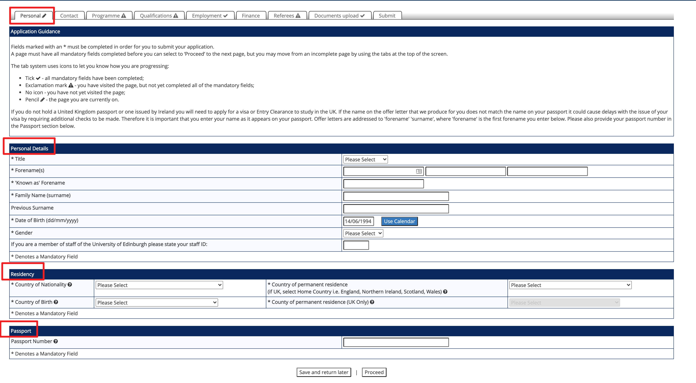
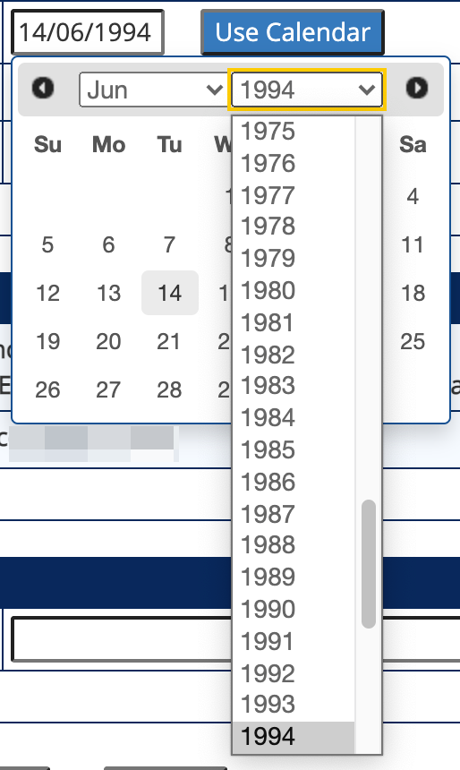
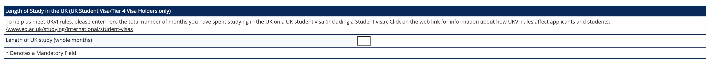
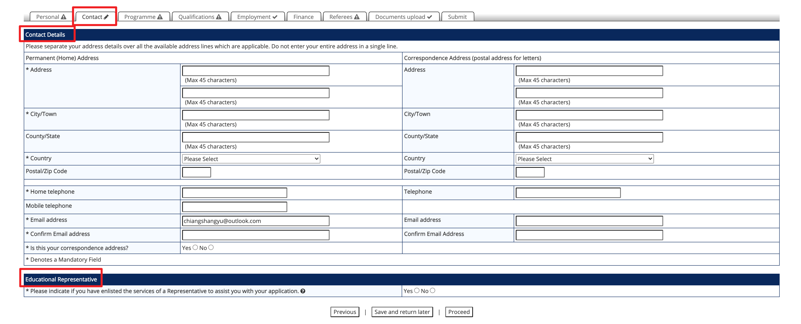
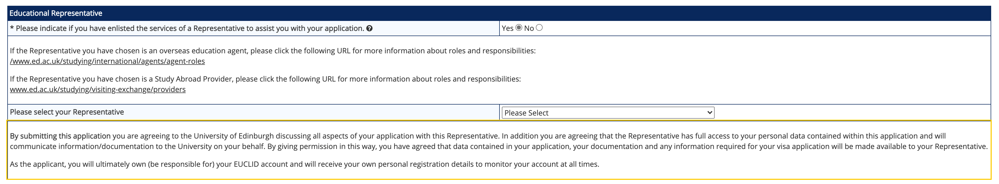
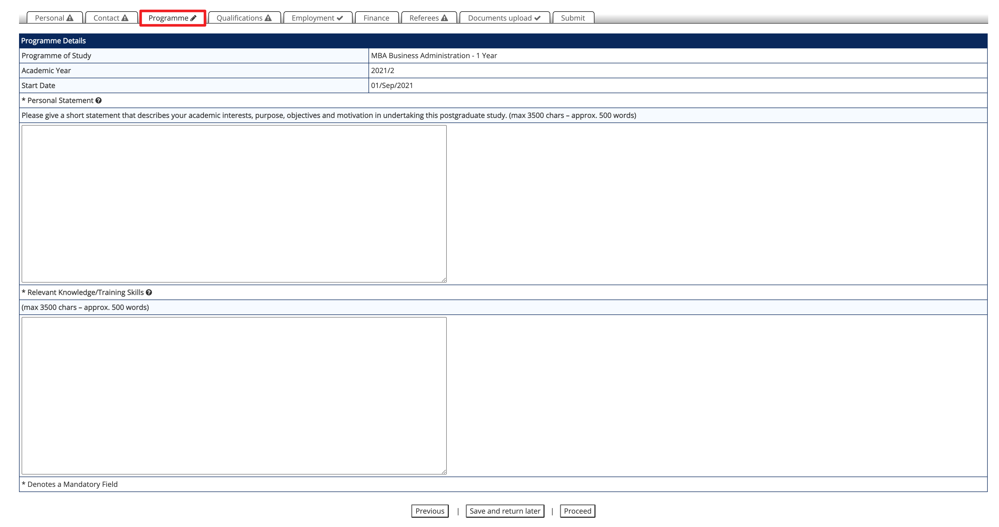
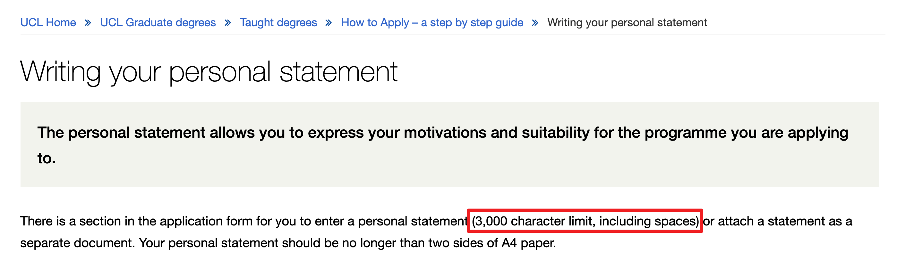
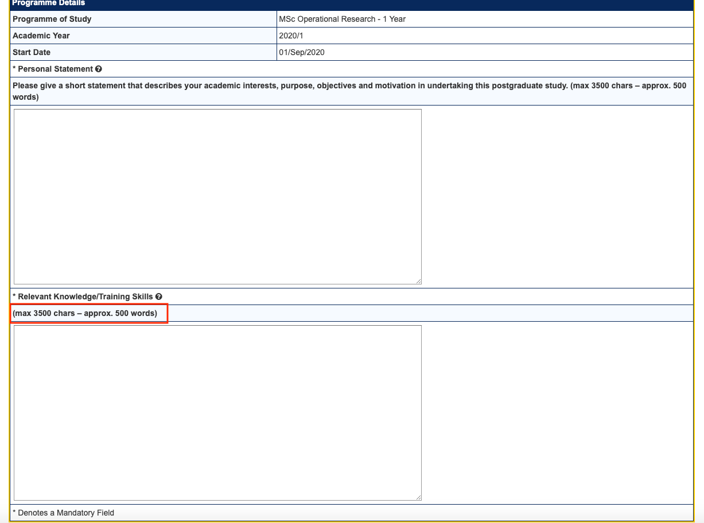
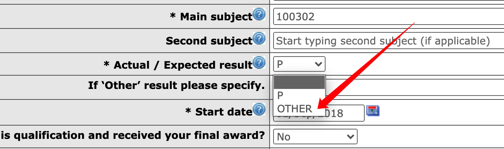

## 递交申请

对于大部分国内学生来说，申请的递交是一个不小的挑战。部分同学甚至可能连申请系统给的提示都不能完全看懂。很多同学因此会感到担心，万一自己填错了某些信息，导致全聚德（就是申请的所有项目都被拒绝了）。 网络上有很多手把手教大家使用国外大学申请系统的教程，大家可以多看看。我自己也录制了几个教学视频，对大家会有些帮助。

在这章，我们将完成所有的项目的申请。我将会讲解申请系统中常见的术语、操作、以及要求等。我会把申请系统里面每一个需要填的空都讲清楚，力求全面和清晰。在这个过程中，我也会补充一些文化和社会方面的背景，帮你理解为什么国外大学的申请系统会那么设计。如果你能够耐心看完这章，配合我的教学视频，你肯定可以比大多数中介都要出色地完成申请递交。

很多同学会担心自己在申请系统里面填写错一些地方会影响录取结果。的确，如果一些重要信息我们填写错了，确实会有影响。另外我也告诉大家，在设计申请系统的时候，设计者就有考虑到要简化系统以及使用简洁直白的语言，他们知道这些系统将会被全球各地的、英语水平不一的学生使用。另外，当我们递交的材料和申请系统里面填写的信息不一致时，招生官会以我们递交的官方文件为准，而不是我们在申请系统里面填写的信息为准。他们也知道并且允许，学生在申请时出现错误，毕竟有些问题不是他们能够避免的，比如说浏览器、网络、甚至文化差异等多方面的问题。举个例子。我们之前有一个同学，David，他自己申请了 UCL 几个项目。后来发现，他把自己的称谓填错为 Ms ，也就是女士的意思。在教育经历那一块，他把本科学习时间写成了护照的签发和失效时间，也就是整整十年。David 很紧张，担心自己的申请会被拒绝。我们写了一封邮件给 UCL 的招生办公室询问这样的情况要怎么处理。对方的回复是：没关系，他们会以递交的官方文件为准。也就是说，性别他们以护照为准，本科学习时间以学位证或者成绩单为准。另外，UCL 方面也表示可以帮忙操作修改，也可以不用管。于是我们请对方帮忙修改，后面也顺利拿到了该项目的 offer。

每个学校的申请系统大致相似，但是也存在一些差别。我们先讲共性，然后再点出一些差异。

**申请递交的一般步骤**

1. 从官方渠道进入申请系统：找到项目的官网，从官网上面的申请（apply）按钮进入申请系统。
2. 在申请系统注册账号：填写自己的邮箱地址（用之前我们注册的 outlook 邮箱或者学校的邮箱），填写自己的生日，护照号码，联系方式等信息。
3. 激活申请账号：部分学校在注册账号后，会发送一个验证邮件到你填写的邮箱地址，你点击里面的链接即可激活账户。
4. 开始填写申请：激活后重新登录账号，进入系统里面开始填写申请。
5. 完成申请的各个方面：你的个人信息、教育经历、工作经历、推荐人的信息、上传证明文件和文书、其他杂项。 
6. 可以正式提交申请（submit），支付申请费（如需）。
7. 完成推荐信上传：如果该学校的系统不接受申请人自己上传推荐信，那么你就需要完成这一步。

注：如果学校接受申请人自己上传准备好的推荐信，同时也可以发邮件给推荐人，我的建议是首先根据你老师的意愿。如果老师并没有偏好，那么建议你直接自己上传，会减少很多麻烦，且对申请基本没有影响。 

递交第一个申请可能会需要花比较多时间，可能一两个小时，但是之后就能非常熟练快速地完成。不仅如此，留学申请本质上和申请外企的工作差不多，需要做的动作都非常类似。所以学习留学申请也是一个一举多得的申请。

申请递交一般都包含三个事情：填资料、传文件、付申请费。接下来我们一个个展开讲。

**填资料**

填资料就是把自己的信息填写到申请系统里面去。

还记得上一个章节我们在准备文件的时候准备了一个个人信息表吗？现在就是它派上用场的时候！在填写网申的时候，把这个表打开和浏览器界面并列，把需要填的信息直接复制粘贴进去吧！

下面我以爱丁堡大学的申请系统为例来过一遍网申的填写。

首先是个人信息（Personal Details）

头衔（ Title）

一般根据情况选择下面中的一个即可：

Mr，Mrs，Ms，Miss 

其中如果是已婚女士，可以选择Mrs，未婚可以是 Ms 或者 Miss 。

名 Forename(s)

就是你的名（注意不包括姓）。比如我是周北辰，那么名我需要填 Beichen 

常用名 'Known as' Forename

有些人可能会有一些常用名和自己的本名并不一样。如果是这样，那么可以把这个名字写在这里。比如说我们有一位同学是一位艺人，她的艺名是秋生。大家都叫她秋生，以致于她的推荐人给她写的推荐信都称她为秋生。所以在这里把这个名字写上，能够侧面证明她的推荐信是确实为她而写的。有一些外国人的名经常被简写。比如说 Christopher 会被叫成 Chris ，然后渐渐地大家都以为他的名字是 Chris，但其实「身份证」上面是 Christopher。

如果你有改过名字，你也可以把之前的名字写在这里。不过后面最好再出具一个改名的证明。

一般情况下我们留空或者复制粘贴我们的本名就好。

姓氏 Family Name (surname)

填写我们的姓氏就好，比如我的姓是周，那么我写上 Zhou。有些同学可能在一些地方看到说要把姓氏的字母全部大写，写成 ZHOU ，这个不是必须的。大写了也不会有什么影响。

前 Previous Surname

想必大家都知道，很多西方国家的人的习俗是女性在婚姻后会改自己的姓氏为男方的姓氏。这也就意味着，这些女性的护照上面的姓氏和她在上学时候的姓氏不一样。这就导致学校出具的成绩单和毕业证的姓氏不匹配她本人现在的姓氏，从而带来问题。

当然这只是国外大学要求填这个信息的原因之一。如果我们的之前的姓氏和现在的不一样，请注意填这个。

出生年月日 Date of Birth (dd/mm/yyyy)

填写出生年月一般有一个小组件可以供我们选择具体的日期。也可以直接复制文字到文本框里面，这个时候必须要注意格式。

性别 Gender or Sex 

首先说一下，在英文里面，Gender 和 Sex 并不是完全的同义词。不过在申请系统里面，出现任何一个都基本上是在问性别。正常填写即可。

如果你对自己的性别有不一样的定义，那么可以选择 Do not wish to disclose, uncategorized 等你认为合适的分类。如果你担心录取受到影响，可以选择以护照为准。另外，你的性别不会对录取结果产生影响。国外大学一般很注意避免在录取过程中发生性别、种族、阶级歧视。

If you are a member of staff of the University of Edinburgh please state your staff ID:

如果你是爱丁堡大学的员工，需要填写上你的职工 ID，这个可以不用管。

然后我们来到 Residency 这个板块。

Country of Nationality 国籍：我们正常填写中国（China）（或者港澳台对应的选项）

Country of Birth 出生国家：我们正常填写中国（China）

Country of permanent residence 永久居住国家：正常也填写中国（China）

County of permanent residence (UK Only) 在英国的永久居住地（只有当你是英国永居民的时候需要填）

当申请人不是英国居民的时候，申请系统会跳出来一个额外的板块，询问申请人在英国的学习时长。如果你有在英国学习过，交换过，就写在英国学习的时长即可。注意，在这里，多一个月少一个月其实没有影响。

在这里普及一个小小的常识。为什么国外学校问了我们国籍还要问我们的出生国，常住国呢？其实他们想确定我们的具体身份，从而确定我们的学费。如果是英国人公民或者居民，欧盟公民或者居民，学费会低不少。而有些人可能会有双重国籍，或者说一个国籍加其他国家或者地区的永居权。所以这个时候就需要问清楚。我有一个朋友是马来西亚公民，但他是英国出生的。这意味着他有英国公民权。他可以随时回到英国，放弃马来西亚国籍，成为英国公民。这个权利受英国宪法保护。事实上，每次他去英国，他其实是可以用出生证明过英国海关的。只不过他还是习惯用马来西亚护照，反正免签。且随身携带出生证明也不方便。

如果他在这里填写上他的国籍是马来西亚，然后出生国是英国，那么英国学校就会按照本国人的标准来收取学费。

填写完一个板块之后，我们点 Proceed 去继续填写。有些学校有一个 Save 的按钮允许我们保存已经填写好的内容，那么也建议随时保存。

填写完个人信息之后我们来到通讯方式 Contact 这个模块。

Contact Details 通讯方式详情

Permanent (Home) Address 永久住址

这个一般填写你的家庭住址或者你的身份证上面的住址即可。

Correspondence Address (postal address for letters) 联络地址

这个地址是指你接收快递、信件的地址。你可能老家在云南，然后在北京上大学，那么这个地址就可以填你的大学地址。

需要注意的是，基本可以确定英国大学不会给你发送纸质文件，所有的沟通都会通过电子邮件完成。香港和新加坡的一些大学可能会给你发纸质版的拒信或者录取信，不过他们也会同时把电子版的文件发给你。你自己打印出来也是完全有效的。 所以这个地址是否准确并不重要。

一般来讲，申请系统会提供一个选项，让你选择永久住址和联络地址是否为同一个。如果是一致的话，那么系统会自动把填好的永久住址复制到联络地址那一栏，或者就直接不用填写联络地址。 像爱丁堡大学的这个系统，就有这么一个选项：

如果你选择 Yes，那么左边填写的永久住址的内容就会被自动填充到右边的联络地址栏目里面，节省时间。

那通讯地址具体要怎么填呢？我们通过示例来看：

假设你的地址是：

广东省 广州市 白云区 朝阳路 同德花园 8 栋 301，邮编是 500062

Address 地址：

301 Block 8, Tongde Garden

Chaoyang Streen, Baiyun District 

City/Town 城镇：Guangzhou

County/State 省或者州：Guangdong 

Country 国家：China

Postal/Zip Code 邮编：500062

> 关于邮编

> Postal code/Zip code 邮编 

> Zip code 是邮编在美国的说法，而 Postal code 则是比较国际通用的叫法。

> 有个时候，邮编是必填的。国内的邮编查询可以直接百度，或者使用这个[小工具](https://www.youbianku.com/)。国外邮编查询也可直接谷歌。

Home telephone 家庭电话：

这个家庭电话可以直接填手机号码，在填写的时候，请注意添加区号。如你的中国的手机号是 131 4566 7899 那么你应该填的是 +86 131 4566 7899。

如果系统提示不能有空格，那么去掉空格，如果说不能有「+」这样的字符，那么就可以把「+」换成「00」，也就是 0086 131 4566 7899。

Mobile telephone 移动电话：可以和家庭电话同。

Email address 电子邮箱地址：申请的邮箱地址，建议用 outlook 或者学校的官方邮箱。注意要和简历上面的邮箱地址保持一致。在出现不一致的时候，学校会以申请系统里面填写的邮箱为准。

填写完通讯详情后，我们来到 Educational Representative 教育代表。

这里其实在问你是否是通过和爱丁堡大学有合作的中介在申请。如果你选择 yes , 那么你需要从一个列表里面选择你的中介。

如果你的中介不在列表里面，或者你是自己申请的，那么可以选择 No 。注意，这里的中介选择并不会给申请带来优势或者劣势。爱丁堡以及其他英国大学和中介的合作条款一般只是给中介学费佣金。

Contact 结束之后就是 Programme 的信息。

爱丁堡这里是需要把文书的文字复制粘贴进去，而不是上传一个 PS 文件。我们准备好文书放进去就好了。

注意，这里的 characters 不是字数的意思，而是字符数。爱丁堡很贴心地告诉我们，3500 字符大概是 500 英文单词。

接下来就是 Qualification 专业背景。在这里先讲三个概念：Academic Qualification, Professional Qualification 和 English Language Qualification。

Academic Qualification：学术资历，比如高中，本科，硕士，博士等都是学术资历，简称学历。

Professional Qualification：专业资历 

English Language Qualification：英语语言资历

Academic Qualification

交换经历，转学，都填 non-degree. 

**传文件**

请注意，你的 CV ，个人陈述等都应该是 PDF 版本，而不是 Word 文档。

有些学校的申请系统，比如格拉斯哥和爱丁堡，并没有上传简历或者文书的地方，这个时候，如果你仍然想要上传，你可以将想要上传的文件与成绩单合并到一个 PDF，在上传成绩单的地方上传这个合并后的材料。

有的学校系统对单个文件的大小有限制，那么你需要用软件压缩该文件。（具体的 PDF 文件修改教程可以看上一章的结尾部分。）

有的时候文件上传上去，由于电脑，系统，或者网络的问题，会有打不开的情况。这个时候学校可能会告诉你，让你重新上传，那么你按照提示重新上传即可。不过我也建议，在上传文件成功后，自己主动下载下来打开，看是否能够打开。这样可以提前确认文件可以正常打开，避免招生办公室打不开，然后补材料耽误申请进度。

* 线下寄材料的情况

目前来说，只有少部分欧洲大陆学校，一些香港学校和新加坡学校需要申请者线下寄送申请材料。如果你申请的学校需要你寄送材料，请按照要求及时寄送。

寄送时的一般要求为：

1. 信封最好用有你学校 logo 和名字的
2. 信封口要有学校教务处或者某个部门的章
3. 信封上面最好写上你的名字，申请号（ID），或者护照号码

顺丰可以寄到大部分地区，而且比较方便，可以作为第一考虑（1-2 周）。如果时间充裕，用中国邮政的挂号信的方式寄出也可以（2-3 周）

**付申请费**

大部分商学院的项目，UCL，KCL，LSE，Cambridge，Oxford 的全部项目都需要交申请费。 申请费从 300-800 RMB 不等。

支付申请费需要有能够支付外币（也就是 VISA 或者 MasterCard 的美元卡或者全币卡）。在支付的时候，请选择使用申请国家的当地货币结算，而不是转换到美元结算，这样可以省下 3-5%的货币转换费。

如果你没有可以支付的卡，可以在淘宝找人有偿帮忙支付。你也可以找我们帮你支付，我们的服务费为 1%。

**申请系统常见术语**

### 需要额外注意的地方

**关于中文材料的翻译**

首先在申请系统中，一定要注意把中文原件和英文翻译件一起上传，不要只上传英文翻译件。（如果你所在的学校的官方语言是英语或者其他语言，则不需要管这条。）

**电话号码怎么写**

Phone number: 0086 

一般情况，+86 是比较好的，但是有些系统在填写电话那一栏可能不支持「+」这个字符，所以用 「00」也可以。

**LSE** 

LSE 会需要你填写还在修的课程的名字和学分（即还没有出现在成绩单上的课程的成绩）。如果在申请时你还没有毕业，那么这里一定要填。如果你并不知道还有哪些课要修，那么可以空着。

**名词解释**

Characters 

在申请系统和学校官网上，很多同学会在字数要求那里看到 Characters 这个词，比如 UCL 的是这样的：

很多同学会以为这个是 3000 个英文单词的意思，但其实不是。在英文里面，一个字母，一个空格，一个标点符号都算作是一个 character。在中文里面，character 更准确的翻译应该是字符数，而不是汉字数量。这个错误很多在美国英国学习了很多年的同学都会犯，大家可以不用担心；可以分享给身边的朋友们这个小小的知识点。

那么字符数和英文字数要怎么转换呢？我们来看看爱丁堡大学的申请系统给的提示：

其中红色框线的区域是：3,500 characters (approximately 500 words) 。 也就是说，大概是 7:1 的关系。利用这个比例，我们可以推算出，UCL 的 3000 个字符大概是 430 个英文单词。

Oxford 大学的申请，填写这一栏的时候，记得选 Other，然后放上自己的百分制成绩哦（P 选项意思是「Pass」）。

**推荐信** 

虽然一些项目要求两个推荐信，但是有的时候，如果两个推荐信只有一个完成了，招生团队也会开始审理。这个时候你会收到一个邮件，说已经开始 review 你的申请。

这个情况可能是系统默认设定需要2个推荐信， 但是实际项目方觉得只要一个，比如 UCL 和LSE。

**什么时候有结果？** 

根据北辰学长的经验，最快的学生大概三个工作日就拿到了 offer，也有等了七八个月的。

大家申请的时候最好用 Outlook 或者 Gmail 邮箱，这样学校有了消息能够第一时间收到。