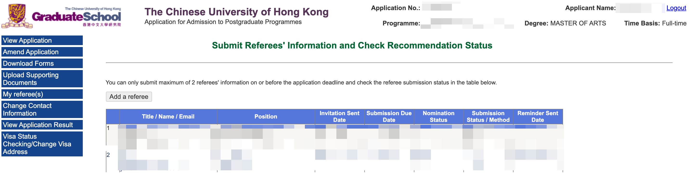

## 第三章 递交申请

对于大部分国内学生来说，申请的递交是一个不小的挑战。部分同学甚至可能连申请系统给的提示都不能完全看懂。很多同学因此会感到担心，万一自己填错了某些信息，导致全聚德（就是申请的所有项目都被拒绝了）。 网络上有很多手把手教大家使用国外大学申请系统的教程，大家可以多看看。我自己也录制了几个教学视频，对大家会有些帮助。

在这章，我们将完成所有的项目的申请。我将会讲解申请系统中常见的术语、操作、以及要求等。我会把申请系统里面每一个需要填的空都讲清楚，力求全面和清晰。在这个过程中，我也会补充一些文化和社会方面的背景，帮你理解为什么国外大学的申请系统会那么设计。如果你能够耐心看完这章，配合我的教学视频，你肯定可以比大多数中介都要出色地完成申请递交。

很多同学会担心自己在申请系统里面填写错一些地方会影响录取结果。的确，如果一些重要信息我们填写错了，确实会有影响。另外我也告诉大家，在设计申请系统的时候，设计者就有考虑到要简化系统以及使用简洁直白的语言，他们知道这些系统将会被全球各地的、英语水平不一的学生使用。另外，当我们递交的材料和申请系统里面填写的信息不一致时，招生官会以我们递交的官方文件为准，而不是我们在申请系统里面填写的信息为准。他们也知道并且允许，学生在申请时出现错误，毕竟有些问题不是他们能够避免的，比如说浏览器、网络、甚至文化差异等多方面的问题。举个例子。我们之前有一个同学，David，他自己申请了 UCL 几个项目。后来发现，他把自己的称谓填错为 Ms ，也就是女士的意思。在教育经历那一块，他把本科学习时间写成了护照的签发和失效时间，也就是整整十年。David 很紧张，担心自己的申请会被拒绝。我们写了一封邮件给 UCL 的招生办公室询问这样的情况要怎么处理。对方的回复是：没关系，他们会以递交的官方文件为准。也就是说，性别他们以护照为准，本科学习时间以学位证或者成绩单为准。另外，UCL 方面也表示可以帮忙操作修改，也可以不用管。于是我们请对方帮忙修改，后面也顺利拿到了该项目的 offer。

每个学校的申请系统大致相似，但是也存在一些差别。我们先讲共性，然后再点出一些差异。

### **申请递交的一般步骤**

1. 从官方渠道进入申请系统：找到项目的官网，从官网上面的申请（apply）按钮进入申请系统。
2. 在申请系统注册账号：填写自己的邮箱地址（用之前我们注册的 outlook 邮箱或者学校的邮箱），填写自己的生日，护照号码，联系方式等信息。
3. 激活申请账号：部分学校在注册账号后，会发送一个验证邮件到你填写的邮箱地址，你点击里面的链接即可激活账户。
4. 开始填写申请：激活后重新登录账号，进入系统里面开始填写申请。
5. 完成申请的各个方面：你的个人信息、教育经历、工作经历、推荐人的信息、上传证明文件和文书、其他杂项。 
6. 可以正式提交申请（submit），支付申请费（如需）。
7. 完成推荐信上传：如果该学校的系统不接受申请人自己上传推荐信，那么你就需要完成这一步。

注：如果学校接受申请人自己上传准备好的推荐信，同时也可以发邮件给推荐人，我的建议是首先根据你老师的意愿。如果老师并没有偏好，那么建议你直接自己上传，会减少很多麻烦，且对申请基本没有影响。 

填写网申的过程中，请及时保存填写好的内容，避免网络或者技术问题导致之前填写的内容没有保存，所有的工作付诸东流。

递交第一个申请可能会需要花比较多时间，可能一两个小时，但是之后就能非常熟练快速地完成。不仅如此，留学申请本质上和申请外企的工作差不多，需要做的动作都非常类似。所以学习留学申请也是一个一举多得的申请。

申请递交一般都包含三个事情：填资料、传文件、付申请费。接下来我们一个个展开讲。

**填资料**

填资料就是把自己的信息填写到申请系统里面去。

还记得上一个章节我们在准备文件的时候准备了一个个人信息表吗？现在就是它派上用场的时候！在填写网申的时候，把这个表打开和浏览器界面并列，把需要填的信息直接复制粘贴进去吧！

下面我以爱丁堡大学的申请系统为例来过一遍网申的填写。

### Personal Details

个人信息

头衔（ Title）

一般根据情况选择下面中的一个即可：

Mr，Mrs，Ms，Miss 

其中如果是已婚女士，可以选择Mrs，未婚可以是 Ms 或者 Miss 。

名 Forename(s)

就是你的名（注意不包括姓）。比如我是周北辰，那么名我需要填 Beichen 

常用名 'Known as' Forename

有些人可能会有一些常用名和自己的本名并不一样。如果是这样，那么可以把这个名字写在这里。比如说我们有一位同学是一位艺人，她的艺名是秋生。大家都叫她秋生，以致于她的推荐人给她写的推荐信都称她为秋生。所以在这里把这个名字写上，能够侧面证明她的推荐信是确实为她而写的。有一些外国人的名经常被简写。比如说 Christopher 会被叫成 Chris ，然后渐渐地大家都以为他的名字是 Chris，但其实「身份证」上面是 Christopher。

如果你有改过名字，你也可以把之前的名字写在这里。不过后面最好再出具一个改名的证明。

一般情况下我们留空或者复制粘贴我们的本名就好。

姓氏 Family Name (surname)

填写我们的姓氏就好，比如我的姓是周，那么我写上 Zhou。有些同学可能在一些地方看到说要把姓氏的字母全部大写，写成 ZHOU ，这个不是必须的。大写了也不会有什么影响。

前 Previous Surname （在有些地方，比如在香港或者新加坡的一个学校，也称作 maiden name）

想必大家都知道，很多西方国家的人的习俗是女性在婚姻后会改自己的姓氏为男方的姓氏。这也就意味着，这些已婚女性的护照上面的姓氏很大可能和她在上学时候（未婚时）的姓氏不一样。这就导致学校出具的成绩单和毕业证的姓氏不匹配她本人现在的姓氏，从而带来问题。

当然这只是国外大学要求填这个信息的原因之一。如果我们的之前的姓氏和现在的不一样，请注意填这个。

出生年月日 Date of Birth (dd/mm/yyyy)

填写出生年月一般有一个小组件可以供我们选择具体的日期。也可以直接复制文字到文本框里面，这个时候必须要注意格式。

性别 Gender or Sex 

首先说一下，在英文里面，Gender 和 Sex 并不是完全的同义词。不过在申请系统里面，出现任何一个都基本上是在问性别。正常填写即可。

如果你对自己的性别有不一样的定义（比如有做过变性手术），那么可以选择 Do not wish to disclose, uncategorized 等你认为合适的分类。如果你担心录取受到影响，可以选择以护照为准。另外，你的性别一般不会对录取结果产生影响。国外大学一般很注意避免在录取过程中发生性别、种族、阶级歧视。

If you are a member of staff of the University of Edinburgh please state your staff ID:

如果你是爱丁堡大学的员工，需要填写上你的职工 ID，这个可以不用管。

然后我们来到 Residency 这个板块。

Country of Nationality 国籍：我们正常填写中国（China）（或者港澳台对应的选项）

Country of Birth 出生国家：我们正常填写中国（China）（或者港澳台对应的选项）

Country of permanent residence 永久居住国家：正常也填写中国（China）

County of permanent residence (UK Only) 在英国的永久居住地（只有当你是英国永居民的时候需要填）

注意，如果你是港澳台学生，你可以选择国家为 Hong Kong, Macao, Taiwan。很多学校提供这些选项。因为一些学校对于不同地区的申请人有不同的申请截止日期。比如 King's College London 的 Accounting 项目对于来自中国大陆的申请人的截止日期是 1 月 7 日，而其他地区则到了 3 月 25 日依旧可以申请。所以，在此处，建议港澳台的学生根据自己的需要选择自己对应的地区。

当申请人不是英国居民的时候，申请系统会跳出来一个额外的板块，询问申请人在英国的学习时长。如果你有在英国学习过，交换过，就写在英国学习的时长即可。注意，在这里，多一个月少一个月其实没有影响。

在这里普及一个小小的常识。为什么国外学校问了我们国籍还要问我们的出生国，常住国呢？据我的“猜测”，其实他们想确定我们的具体身份，从而确定我们的学费。如果是英国人公民或者居民，欧盟公民或者居民，学费会低不少。而有些人可能会有双重国籍，或者说一个国籍加其他国家或者地区的永居权。所以这个时候就需要问清楚。我有一个朋友是马来西亚公民，但他是英国出生的。这意味着他有英国公民权。他可以随时回到英国，放弃马来西亚国籍，成为英国公民。这个权利受英国宪法保护。事实上，每次他去英国，他其实是可以用出生证明过英国海关的。只不过他还是习惯用马来西亚护照，反正免签。且随身携带出生证明也不方便。

如果他在这里填写上他的国籍是马来西亚，然后出生国是英国，那么英国学校就会按照本国人的标准来收取学费。

填写完一个板块之后，我们点 Proceed 去继续填写。有些学校有一个 Save 的按钮允许我们保存已经填写好的内容，那么也建议随时保存。

一个小 Tip：如果你当次没有完成申请，下次想要进入系统继续完成申请的话，可以看看学校是否给你邮箱里面发了一个邮件，里面包含一个一键回到申请页面的链接。比如下面的这个邮件：

### Contact

通讯方式 

Contact Details 通讯方式详情

Permanent (Home) Address 永久住址

这个一般填写你的家庭住址或者你的身份证上面的住址即可。

Correspondence Address (postal address for letters) 联络地址

这个地址是指你接收快递、信件的地址。你可能老家在云南，然后在北京上大学，那么这个地址就可以填你的大学地址。

需要注意的是，基本可以确定英国大学不会给你发送纸质文件，所有的沟通都会通过电子邮件完成。香港和新加坡的一些大学可能会给你发纸质版的拒信或者录取信，不过他们也会同时把电子版的文件发给你。你自己打印出来也是完全有效的。 所以这个地址是否准确并不重要。

一般来讲，申请系统会提供一个选项，让你选择永久住址和联络地址是否为同一个。如果是一致的话，那么系统会自动把填好的永久住址复制到联络地址那一栏，或者就直接不用填写联络地址。 像爱丁堡大学的这个系统，就有这么一个选项：

如果你选择 Yes，那么左边填写的永久住址的内容就会被自动填充到右边的联络地址栏目里面，节省时间。

那通讯地址具体要怎么填呢？我们通过示例来看：

假设你的地址是：

广东省 广州市 白云区 朝阳路 同德花园 8 栋 301，邮编是 500062

Address 地址：

301 Block 8, Tongde Garden

Chaoyang Streen, Baiyun District 

City/Town 城镇：Guangzhou

County/State 省或者州：Guangdong 

Country 国家：China

Postal/Zip Code 邮编：500062

> 关于邮编

> Postal code/Zip code 邮编 

> Zip code 是邮编在美国的说法，而 Postal code 则是比较国际通用的叫法。

> 有个时候，邮编是必填的。国内的邮编查询可以直接百度，或者使用这个[小工具](https://www.youbianku.com/)。国外邮编查询也可直接谷歌。

Home telephone 家庭电话：

这个家庭电话可以直接填手机号码，在填写的时候，请注意添加区号。如你的中国的手机号是 131 4566 7899 那么你应该填的是 +86 131 4566 7899。

如果系统提示不能有空格，那么去掉空格，如果说不能有「+」这样的字符，那么就可以把「+」换成「00」，也就是 0086 131 4566 7899。

Mobile telephone 移动电话：可以和家庭电话同。

Email address 电子邮箱地址：申请的邮箱地址，建议用 outlook 或者学校的官方邮箱。注意要和简历上面的邮箱地址保持一致。在出现不一致的时候，学校会以申请系统里面填写的邮箱为准。

填写完通讯详情后，我们来到 Educational Representative 教育代表。

这里其实在问你是否是通过和爱丁堡大学有合作的中介在申请。如果你选择 yes , 那么你需要从一个列表里面选择你的中介。

如果你的中介不在列表里面，或者你是自己申请的，那么可以选择 No 。注意，这里的中介选择并不会给申请带来优势或者劣势。爱丁堡以及其他英国大学和中介的合作条款一般只是给中介学费佣金。

Contact 结束之后就是 Programme 的信息。

爱丁堡这里是需要把文书的文字复制粘贴进去，而不是上传一个 PS 文件。我们准备好文书粘贴进去就好了。

注意，这里的 characters 不是字数的意思，而是字符数。爱丁堡很贴心地告诉我们，3500 字符大概是 500 英文单词。

### Qualification

接下来就是 Qualification 专业背景。

在这里先讲三个概念：Academic Qualification, Professional Qualification 和 English Language Qualification。

Academic Qualification：学术资历，比如高中，本科，硕士，博士等都是学术资历，简称学历。

其中交换经历，转学，都填 non-degree. 

在有些系统里面你会看到 First degree，它指的是大学学位。 

请注意 Master's degree 和 Master's diploma 或者 Postgraduate diploma 并不是同一个概念。只有 Master's Degree 是正常的硕士学位。而后面两个更像是没有写完毕业论文，学校给的硕士毕业证（没有硕士学位的那种）。

在填写学位的 Class 或者 Grade 的时候，你可能会遇到下面几个选项：

如果你的本科学校使用的是 class，分级系统，比如一等学位，二等学位，那么你可以选择对应的选项。对于大部分大陆的同学，我建议选择百分制的成绩（在申请英国的时候）或者 GPA。因为英国教育系统的特点，招生官比较习惯看百分制成绩（前面也有说过，有时候英国学校会专门发邮件要求学生出具一个百分制成绩单）。对于美国和其他地区，百分制和 GPA 都可以，后者会更好一点。注意，在填写 GPA 的时候，你需要在合适的地方提供多少分是满绩点这个信息。有写学校使用 4.0，有些 4.3，有些 5.0。所以，如果那一栏的格式允许，请一定要标注清楚，比如你的绩点是 3.6，满分是 4.3，那么就写 3.6/4.3。有些系统不允许填「/」这样的字符，只允许数字和小数点，那么一般就会给一个单独的一栏，让你填满分是多少这个信息。

另外，牛津大学的申请，填写这一栏的时候，记得选 Other，然后放上自己的百分制成绩哦（P 选项意思是「Pass」）。

粗糙地来讲，大陆的本科和英国的学位分级可以这么对应：

| 英国                       | 中国（百分制） | 中国（4.0 绩点制） |
| -------------------------- | -------------- | ------------------ |
| 一等学位(1st class)        | 90             | 3.7                |
| 2.1 （又写作 2:1，二等一） | 80             | 3.3                |
| 2.2 （2.2，二等二）        | 75             | 2.9                |

信息来源：[英国政府官方网站（基于一个 2011 年的研究）](https://assets.publishing.service.gov.uk/government/uploads/system/uploads/attachment_data/file/696346/Overseas_degree_equivalency_table_-_updated.xlsx)

不同的学校会根据学生所在的中国大学的排名来微调这个对应关系。比如，爱丁堡等学校认为中国双非院校85 分或者以上才能对应他们的 2.1 学位。

Professional Qualification：专业资历 （或者资质），比如 ACCA，CFA，经济师，建筑师，心理咨询师，某行业从业资格证等，这一栏一般可以不填。如果你有，可以填上去。

English Language Qualification：英语语言资质：雅思，托福，PTE，Duolingo等。对于绝大多数英国学校，如果你在申请的时候没有英语成绩，你可以大大方方地填写上你的暂时没有英语证书。如果被提示要填写未来打算考试的日期，也可以简单写一个未来的日期，并不需要是实际已经确定的考试日期。

有非常小部分的英国研究生项目（大概 1%吧）是需要在申请的时候提供英语成绩的，请在申请的时候注意确认。

### Employment

工作经历，履历

如果你没有什么工作履历，这个部分可以留空。

如果你的工作履历比较多，这个部分往往比较繁琐，要填的内容比较多，且基本上是重复简历上面的内容。有些同学，尤其是在申请了比较多的项目的时候，可能会想要偷懒不填写，直接在后面上传 CV，让招生官看 CV 去。很高兴地告诉你，这么做似乎也是可以的。根据我的经验，这个部分不填，但是上传了 CV，似乎并不会给申请带来负面影响。

但是我还是要提醒一句，如果没有上传 CV 的地方，你一定要想办法上传 CV。可以和你的 PS 合并在一起上传，也可以上传到其他合适的地方。切记不可既不填写这个工作经历部分，又不上传 CV。

下面我们来看看如果你需要填的话，每一个地方要怎么填。

Employer Name：雇主名字，一般就是公司名字，**而不是**你的上司、领导的名字。注意，不需要填公司的法律注册名，可以用该企业的常用的对外的名字。比如你在百度工作，你不需要写百度公司在工商局的注册名（北京百度网讯科技有限公司），直接填写百度即可。

Start date, End Date：入职和离职日期，不需要特别精确，如果还没有离职，那么离职日期留空即可。

Job Title：职位，正常填写即可

Employer Address：填写公司所在地。一般而言，具体到城市即可，比如：中国北京，Beijing, China。如果是线上的工作，那么写 Remote Work。如果你想要幽默一下，也可以写 Zoom。

Key Responsibilities：主要工作职责。填写你的工作职责，注意，这里就不要像简历里面那样用动词的过去式了，用动词原型就好。

### Finance

学习资金

这个部分问的是你的学习资金的来源。对于大部分自费留学的申请人来说，可以写 Self-fund。

有些地方可以选 Self, Family, Company 等。你如实填写即可。

这个部分对录取没有影响。

如果你有意申请奖学金，那么请仔细查看申请方式。

### Referees

推荐人信息，或者推荐信，Reference, Refence Letters 

推荐人信息填写全页面

推荐人信息填写具体的栏目

Email reference request：是否向推荐人通过邮件发送推荐信递交请求？如果填是，那么系统会给推荐人发邮件邀请对方填写推荐信。如果填否，那么申请人可以自己上传推荐人准备好的推荐信。

注意，此处细心的同学可能会问，会不会选“Yes” 更好呢？学校那边看到是推荐人自己上传的，会觉得更加可信一些？

这样的考虑可以理解，但是在实际操作层面，似乎对录取结果并没有影响。另外，试想，既然爱丁堡给了两个选项，就应该会做到一视同仁。

Title：头衔

头衔会有以下这些选项。

一般对方是博士或者教授，那么可以写 Dr 或者 Prof （或者 Professor）。如果不是，就选 Mr/ Ms /Mrs 即可。

First name & Last name: 名和姓。

Institution：所在机构。填写所在机构的公司或者学校全称。

Country：国家

Email address：邮箱地址

注意，邮箱地址一定要多确认一两次，避免出错。否则改起来会比较麻烦。

爱丁堡（以及其他一些学校）虽然明确要求要机构邮箱，但其实我们也有用 163，QQ 等邮箱的推荐人，并且拿到 Offer 的案例。如果你的推荐人实在无法提供机构邮箱，那么也可以用私人邮箱。如果这么做，那么建议在推荐信里面用一两句话解释一下不能提供机构邮箱的原因。

有些学校的申请系统会要求填写你和推荐人的关系，（英文：Relationship）。那么你可以填 Academic 或者 Professional （学术关系和职业关系）。如果是学校的老师，导师，那么写 Academic。如果是公司的领导或者同事，那么写 Professional。

有些项目并不需要推荐信，比如这里。

### Document Upload 

文件上传

传文件这个部分非常重要。任何申请，你都应该力求上传这几个文件：

1. CV
2. PS
3. 成绩单和毕业证学位证（如果有）
4. 护照
5. 推荐信（大部分情况下）

爱丁堡此处的文件上传简单直白，故不多做解释。

下面我来讲一下传文件一般会遇到的问题。

**传文件**

你的 CV ，个人陈述等都应该是 PDF 版本，而不是 Word 文档。如果你的毕业证等材料扫描出来是图片格式的，那么请最好转换为 PDF 格式。（如何转换第二章的最后面有教程）。

有些学校的申请系统，比如格拉斯哥和爱丁堡，并没有上传简历或者文书的地方，这个时候，如果你仍然想要上传，你可以将想要上传的文件与成绩单合并到一个 PDF，在上传成绩单的地方上传这个合并后的材料。

有的学校系统对单个文件的大小有限制，那么你需要用软件压缩该文件。

有的时候文件上传上去，由于电脑，系统，或者网络的问题，会有打不开的情况。这个时候学校可能会告诉你，让你重新上传，那么你按照提示重新上传即可。不过我也建议，在上传文件成功后，自己主动下载下来打开，看是否能够打开。这样可以提前确认文件可以正常打开，避免招生办公室打不开，然后补材料耽误申请进度。

**线下寄材料的情况**

目前来说，只有少部分欧洲大陆学校，一些香港学校和新加坡学校需要申请者线下寄送申请材料。如果你申请的学校需要你寄送材料，请按照要求及时寄送。

寄送时的一般要求为：

1. 信封最好用有你学校 logo 和名字的
2. 信封口要有学校教务处或者某个部门的章
3. 信封上面最好写上你的名字，申请号（ID），申请的项目名，以及护照号码

顺丰可以寄到大部分地区，而且比较方便，可以作为第一考虑（1-2 周）。如果时间充裕，用中国邮政的挂号信的方式寄出也可以（2-3 周）。

### Other information 

其他背景信息

这部分一般是一些市场调查，种族、民族，宗教，性取向，是否残疾等问题。这里填写的信息不会给到审核官，不会影响录取。正如上图红线划出的句子所承诺的。

你可以如实填写这些信息，也可以选择 「Prefer not to say」，或者「Information refused」。

### Submit

提交申请

恭喜你到了这一步！在你填写了所有的必要内容后，你就可以点击提交啦！不过我的建议是再回去检查一遍。重点看看教育经历，工作经历，个人信息（性别，生日，护照号码，名字等），推荐信，上传的文件这几个部分。

确认没有问题后，就放心提交吧！

提交后，大部分学校会给你的邮箱发送一封邮件告诉你他们已经收到了你的申请，会尽快开始处理。

注意：

从 2021 秋季申请季开始，有些同学遇到这种情况：明明已经递交了该项目的申请，收到了学校的确认邮件，过了一两周，学校还是发送邮件过来说该申请还未提交。

如果你也遇到这个情况，建议你登录学校的申请系统看一下该项目是否已经成功提交。如果系统里面有记录，则忽略该邮件。如果没有，那么联系招生办公室。不要轻易再重新提交一次。

**付申请费**

提交后，你可能会需要支付申请费。

大部分商学院的项目，UCL，KCL，LSE，Cambridge，Oxford 的全部项目都需要交申请费。 申请费从 300-800 RMB 不等。

支付申请费需要有能够支付外币（也就是 VISA 或者 MasterCard 的美元卡或者全币卡）。在支付的时候，请选择使用申请国家的当地货币结算，而不是转换到美元结算，这样可以省下 3-5%的货币转换费。

如果你没有可以支付的卡，可以在淘宝找人有偿帮忙支付。你也可以找我们帮你支付，我们的服务费为 1%。

### 需要额外注意的地方

####**关于中文材料的翻译**

首先在申请系统中，一定要注意把中文原件和英文翻译件一起上传，不要只上传英文翻译件。（如果你所在的学校的官方语言是英语或者其他语言，则不需要管这条。）

#### **电话号码怎么写**

Phone number: 0086 

一般情况，+86 是比较好的，但是有些系统在填写电话那一栏可能不支持「+」这个字符，所以用 「00」也可以。

#### **LSE** 

LSE 会需要你填写还在修的课程的名字和学分（即还没有出现在成绩单上的课程的成绩）。如果在申请时你还没有毕业，那么这里一定要填。如果你并不知道还有哪些课要修，那么可以空着。

#### 名词解释

Characters 

在申请系统和学校官网上，很多同学会在字数要求那里看到 Characters 这个词，比如 UCL 的是这样的：

很多同学会以为这个是 3000 个英文单词的意思，但其实不是。在英文里面，一个字母，一个空格，一个标点符号都算作是一个 character。在中文里面，character 更准确的翻译应该是字符数，而不是汉字数量。这个错误很多在美国英国学习了很多年的同学都会犯，大家可以不用担心；可以分享给身边的朋友们这个小小的知识点。

那么字符数和英文字数要怎么转换呢？我们来看看爱丁堡大学的申请系统给的提示：

其中红色框线的区域是：3,500 characters (approximately 500 words) 。 也就是说，大概是 7:1 的关系。利用这个比例，我们可以推算出，UCL 的 3000 个字符大概是 430 个英文单词。

#### **推荐信**

虽然一些项目要求两个推荐信，但是有的时候，如果两个推荐信只有一个完成了，招生团队也会开始审理。这个时候你会收到一个邮件，说已经开始 review 你的申请。

这个情况可能是系统默认设定需要2个推荐信， 但是实际项目方觉得只要一个就够了，比如 UCL 和LSE的部分项目就会这么操作。

遇到这种情况，不用慌。也许你会担心少了一封推荐信会不会降低你的录取可能性。你的担心不无道理。问题是，根据我们的经验，即使这个时候你写信要求招生办公室等你的另一个推荐信到了再开始审理，或者说在审理的时候考虑你最近提交的推荐信，他们也不会按照你说的做，除非你撤回（withdraw）申请并且重新递交。我们的建议是，少一个推荐信并不会带来什么影响，可以让招生官就这么做。

#### **英语语言成绩**

在申请英国的绝大部分研究生项目时，英语成绩不是必填的。一般来讲，你会有几个选择：

* 我已经有语言成绩，我会上传（这个选项会让你上传成绩和成绩单）
* 我已经预定了一次英语考试（这个选项会让你填写预定的考试的时间）
* 我暂时还没有预定考试（这个选项会让你直接进入下一步）

请注意，除了第一个选项可能对你的申请有一点点影响外，其他对你都没有什么影响。我们的建议是选择第二个，然后选择一个比较靠后的日期作为考试时间，从一定程度上像招生官展示你的 seriousness--即你对这个申请的认真态度。

如果你在申请的过程中，遇到了不填就无法进入到下一步的情况，那么很可能是哪里填错了。这个时候，回去检查一下其他的信息再看看。如果学校的系统要求你必须上传一个文件才能进入到下一步，而项目的网站或者小秘告诉你说可以先不上传成绩，那么你可以自己做一个简单的 PDF 当做成绩单传上去，这样你就可以进入到下一步了。

PDF 文件要解释你为什么这么做，你为什么不能提供，以及你从哪知道可以这么操作。（看情况，不一定都包含）

比如：
Dear Admission Office, 

I am not able to upload a valid English language certificate at this moment as taking a test is extremely difficult during Covid-19 (或者：My academic study in the final year/semester is quite challenging.) But I have booked a test scheduled on 17th June 202X. (写一个比较靠后的日期)

According to your website (or XXX from the admission office), I can upload the copy of the certificate at a later date. So I am using this explanation in the application system so I can complete the online applicatio. 

Thank you. 

XXX

对于爱丁堡大学，在招生办公室开始审理后，申请系统里面会提示说英语语言证明未提交，然后标注一个大大的叹号。

不用担心，你的申请会正常审理，标注了叹号不意味着他们需要你提交才能继续审理。（同时你也可以看到，这里也说毕业证没有上传。但是不用担心，系统也说了，可以忽略这个信息。毕竟，这个同学也没有毕业，无法提供这个材料。）

如果在申请的时候，你有一个过期了的，或者说没有达到要求的语言成绩，你应该上传吗？

我们的建议是，上传。虽然经验来看，有英语成绩，即使是合格的英语成绩，也不会给你的申请带来显著的加分作用。不过录取是个非常主观的过程，在一定程度上是个概率事件，说不定某个招生官在看你的材料，犹豫不决的时候，看到你的英语成绩，突然觉得这个说明你可以在项目里面很好地学习，然后就录取了你。

另外，如果你已经拿到 conditional offer，并且最近考试的分数并没有达到要求，那么你仍然可以上传已有的英语成绩单到系统里面。有个时候，学校可能会给一些通融 (concession)。比如，有一个学生的雅思成绩和学校的要求如下：

总分差了 0.5，听力也差了 0.5。

有一天学生收到格拉斯哥大学的邮件说如果你还没有完全达到你的 offer 的录取要求，那么你仍然可以上传已有的材料，学校会考虑给你推迟入学或者换到一个要求更低的项目。

学生（Lusy）于是上传了一个听力差 0.5 分的雅思成绩单，过了不久，申请系统直接显示 completed，意味着符合要求的语言成绩已经上传完成。

怎么会有这样的好事呢？Lusy 本来还想再继续鏖战雅思，看到这个非常开心。但是我们也担心是学校弄错了，那么到时候学校意识到这个错误的时候，Lusy 可能去不了，因为学校这边愿意将错就错，英国移民局那边也可能会遇到麻烦。抱着稳妥的心态，我们邮件问了下学校，得到了非常肯定且积极的回复：

恭喜Lusy 不用再考雅思了！不过说实话，我们仍然不确定回复我们的这个人有没有深入去看这个 case，Ta 也许只是觉得系统说完成了那就完成了，Ta 没有必要去推翻其他同事的决定。不管怎么样，Lusy 现在已经尽到了询问确认的义务。如果之后发生任何事情，学校要收回 unconditional offer 或者Lusy 在英国移民局遇到了麻烦，Lusy 会有权利要求学校赔偿相关损失。

对于其他大学，你也可以试试先上传已有的成绩单，不管是否达到了要求。

#### 关于 HKU，CUHK 和 IC的申请

HKU商学院 （2022 Fall 申请季）

香港大学商学院的申请是先填写申请表格后，支付申请费，然后大概一天之后你的邮箱会收到一封邮件，里面包含一个上传文件的系统的链接，和上传文件指导。

这个是链接：[HKU Business School| TPg Application Document Upload System](https://tpgapply.fbe.hku.hk/tpg_review_check/)

请注意，如果你在 DDL 当天，比如 12 月 7 日，递交了申请，而这个邮件在 8 号才来，你仍旧是算作在 DDL 前递交了申请的。我们的一个案例表明是这样的。不过，任何时候我们都不建议在 DDL 当天递交申请！

港大的邮件

HKU 其他学院

在你提交申请之后，第二天你会收到这样的邮件。点击邮件里面的链接，你就可以上传成绩单等文件了。

这个项目所有的纸质文件都在拿到 offer 之后上传。申请期间不需要。大部分 HKU 的项目都是如此。

上图为港大推荐信管理页面，你可以添加新的推荐人，移除推荐人，也可以给推荐人发送提醒邮件。

香港中文大学（CUHK）

CUHK 的申请很正常，除了推荐信。你在填写申请的时候，会找不到地方填写推荐人信息。你没有看错哦。CUHK 的系统是只有在你提交了全部的材料和信息之后，交了申请费后，再登录回去系统，会看到一个 tab 叫做 add referee。我想你现在应该知道怎么做了 :)

帝国理工（IC)

IC 的申请也是，填写了信息之后，缴费后会出现上传文件和添加推荐人信息的地方。不慌。

#### 一个学校申请多个项目

大部分学校的申请系统里面，如果要申请多个项目，流程和申请第一个的一致（即通过项目的官网，点击申请）。但是有两个学校不太一样：IC 和 LSE。

在申请第一个项目的时候，IC 和 LSE 的申请系统会询问你是否需要申请第二个项目。如果你需要申请两个且准备好了同时申请，那么可以一次都提交，这样你只需要付一次申请费，老师也只需要上传一次推荐信。同时，在这个机制下，只有你的第一志愿被拒绝后，你的第二个项目的申请才会被传送到招生官那里进行审理。

如果你这次只申请一个，日后想要再添加一个，那就稍微会麻烦些。首先你需要等到第一个项目的结果出来后才递交申请。对于 LSE，你需要填写一个简化版的表格，并且通过这个表格上传最新的个人陈述。LSE 也可以申请第三个、第四个项目，同样需要填写一个表格，并且支付额外的申请费。

添加项目和支付申请费的表格在此处：

[How do I...? (lse.ac.uk)](https://www.lse.ac.uk/study-at-lse/Graduate/Applicants/How-do-I/Secure)

IC 不支持在递交完申请后添加额外的项目。

### 什么时候有结果？

根据我们四五年的经验，最快的学生大概三个工作日就拿到了 offer，也有等了七八个月的。一般来说，学校官方的承诺是 4-6 个星期，如果过了这么久你还没有收到结果，那么你可以邮件或者电话问一下招生办公室。有的学校，比如 UCL，爱丁堡，华威会提前邮件告知学生，录取结果可能一时半会出不来。

UCL 邮件告诉申请人，申请还在审理中，一时半会出不来，同时也不要联系招生办公室，因为这样反而会延缓审理进程。

大家申请的时候最好用 Outlook 或者 Gmail 邮箱，这样学校有了消息能够第一时间收到。并且也要时常查看垃圾箱，说不定一封梦校的录取就静静躺在垃圾箱里。

