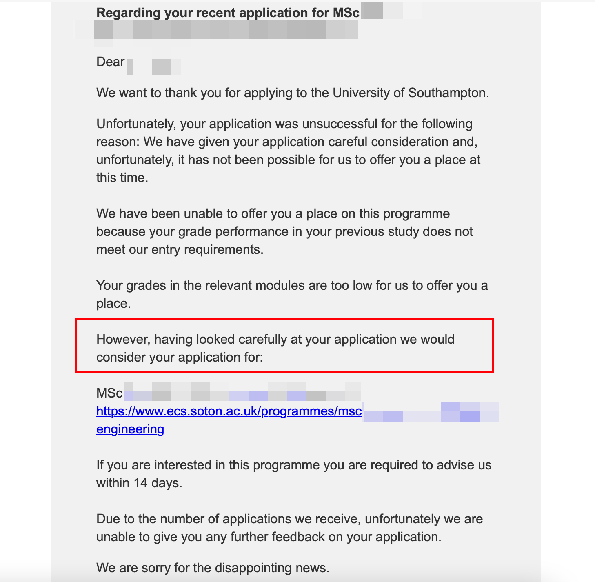
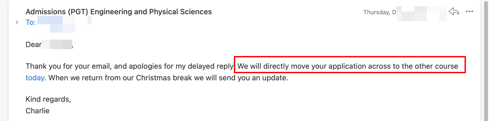
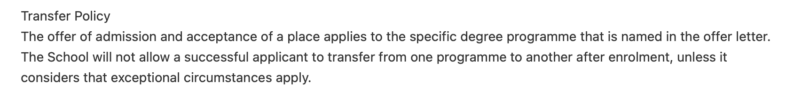
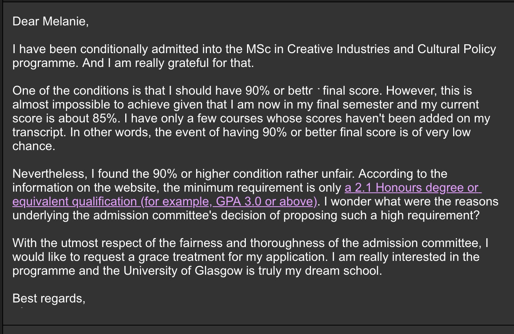
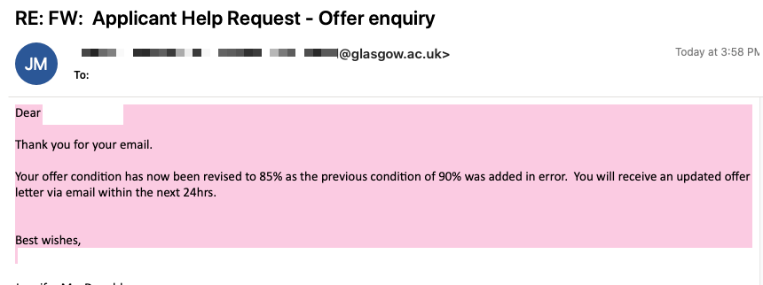
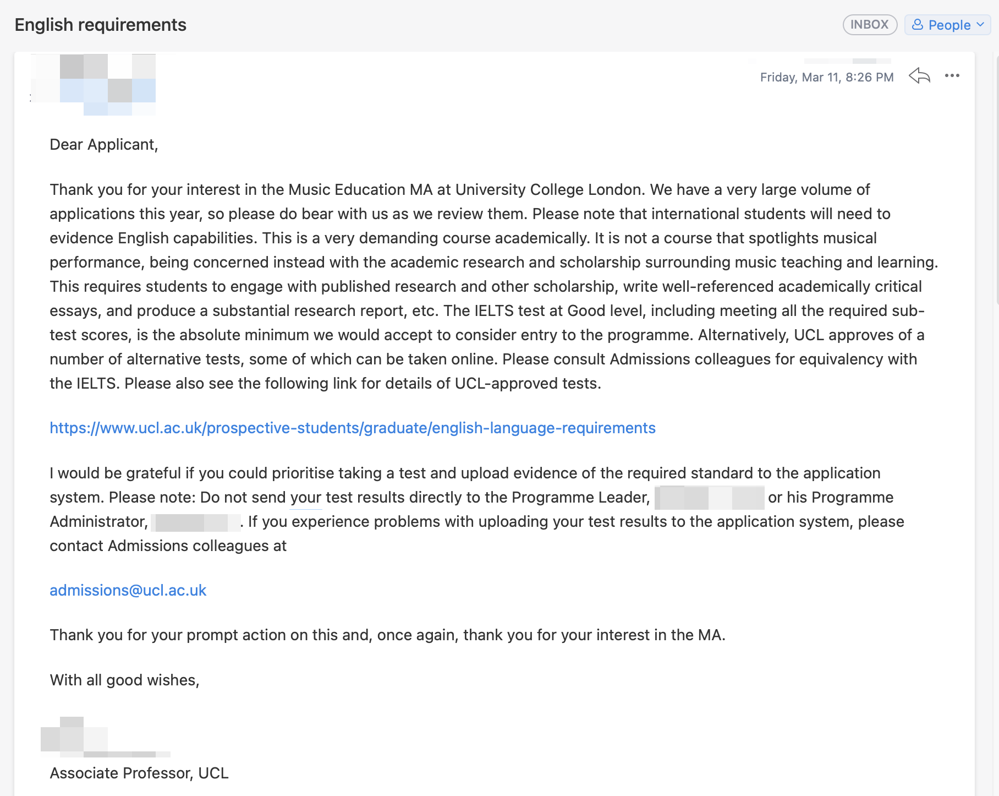
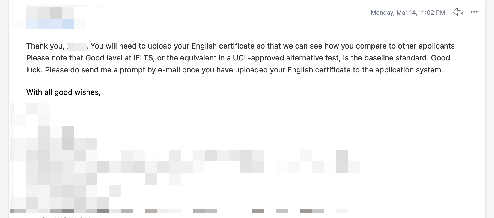
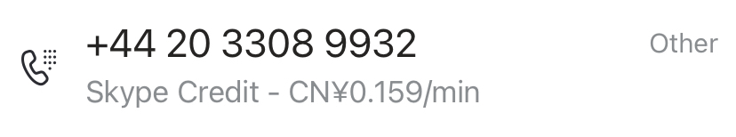

# 第四章 正确地和招生官沟通

提交申请后，大部分情况下，我们可以耐心地等待录取结果。但是也有时候我们需要和招生官沟通，解决一些问题。

在这一章，我们讲一下申请之后你可能会遇到的问题，需要做的申请。很多同学会很忐忑，担心自己没有理解清楚招生官的意思。事实也如此，我经常发现英语不是很好的同学不能很好地理解招生官的邮件，用翻译软件翻译出来的内容也有时候会很 misleading。

### 我发现申请系统里面我填错了信息，想要修改，怎么办？

首先，不要慌。

经验表明，填错了信息并不会完全导致你的申请无效。我们曾经有一个同学，她把自己的称呼写成了 Mr，把自己的大学教育时间写成了自己的护照有效期时间... （也就是说，她的大学读了十年）。

后来我们帮她打电话给 UCL 的招生办公室寻求对策，小秘说没有关系的，招生官会以提交的官方的文件为准，而不是申请系统里面提交的信息。如果成绩单或者学位证上面写的是 4 年，那就是 4 年。我们问是否有必要修改，她说不是完全必要，同时表示如果希望改她可以帮我们改。

我们很感动。

所以，填错信息的时候，如果是重要的信息，那么需要联系学校尽快修改，如果不那么重要，可以不用修改。

这些信息是重要的：名字，性别，国籍，护照号码（或者身份证号码）

如果你文件传错了，也需要第一时间更改。

说一个小趣事，如果你发现你在 A 项目上传了 B 项目的文书，且无法修改，那么你还是有可能获得录取的。我们有一个申请爱丁堡大学的同学就是如此。

说回来，如果你需要修改信息或者文件，要如何去沟通呢？

首先你要看看申请系统是否支持自助修改。遗憾的是，很多学校的系统都不太支持这个。所以大概率，你需要写邮件给招生办公室（AO)，让他们帮你做修改。如果是在申请 DDL 之前，那么他们大概率会给你修改。如果在 DDL 后，文书，CV，雅思成绩等材料就一般不能修改了，个人信息一般还是可以修改的。

如果你实在需要一个模板，你可以这么说：

Dear Admissions,

Due to some technical issues, there seems to be some wrong information/documents in my application. 

I would really appreciate if you could help me correct my application. 

Here are the specific items to be corrected: 

1. My name is XXX, instead of XXX. 
2. My latest IELTS report is attached in the email.
3. My updated CV is attached in the email.  

I understand that it is the student's reponsiblity to make sure they submit the right application; but while I double checked every details of my application, somehow these errors were just so difficult to find out.

If you could spend a few minutes on this, you would really make a difference in my life.  

Thanks,

Grace Li

### 学校让我换专业怎么办？

有的时候，学校会拒绝你一个项目的申请，但是同时告诉你，如果你申请另外某某项目，他们会考虑你的申请。

比如南安普顿大学的这个案例：

这个时候，如果你希望拿到学校推荐的项目的 offer，那么你可以按照他们的要求回复。一般来说，这个时候，如果你申请这个项目，学校几乎一定会给你 offer。

你也需要问清楚是否需要重新递交一份申请。大部分时候，你不需要向那个项目提交申请（也就是说不需要额外提交一次申请）。比如南安普顿的招生办公室就表示不需要，而且都不需要新的文书：

不过也有可能需要重新提交，建议询问清楚。

后来这个学生成功拿到了 offer。

### 在收到 offer 后，我希望转到其他项目去学习，可以吗？要怎么做？

有可能可以。你是否能够转过去取决于你想要去的项目竞争是否激烈。对于那些竞争比较激烈的学校或者项目，你希望 transfer 过去是非常难的。比如你拿到了 LSE 某冷门专业的录取，想要换到 LSE 的金融学，那基本就不要想了... 

---

有一个比较近的案例就是一个拿到了 SOAS 的 MA Chinese Studies 录取的同学后面想换到 MA Social Anthropology 去，她写了一封比较长的邮件，包含了自己的转项目动机，给 SOAS 的招生办公室。在 10 天后，她顺利拿到了新的 offer。

---

所以，当两个项目的录取难度相当的时候，或者你最终想去的那个项目你有很高的录取率，那么你可以申请转。

对于 G5 来说，几乎不允许转项目，你想去那个项目只能提交新的申请。

那么，如果我希望在入学后转到其他的项目去呢？

这个和上面的原则一致，如果这个项目还有空位，且你的条件符合录取标准，那么学校会考虑你的申请。但是有部分学校还是明确表示不允许的。例如，以下是 LSE 给学生的 offer 中提到的：

LSE 说得很清楚，除非是极端的特殊情况，不允许在入学后（Enrolment）变更 programme。不过什么是极端的特殊情况呢？LSE 没有给出说明。

但是请注意，如果你在申请转变项目的时候你已经拿到了 CAS，或者说已经拿到了签证，那么你的申请可能会被学校以移民局的政策要求为理由拒绝。那么我们建议你抵达英国后再尝试申请，找到你的系主任或者学校的相关负责人，认真地表达你的诉求，然后看看运气。

### 我申请被拒绝了，我能试试 argue 吗？

可以试试，但是必须提前告诉你，argue 成功的可能性很低。

尽管可能性很低，我们仍然建议你尝试。

成功的 argue 案例可以参考我们的官网博客内容。

### 如果学校 con 我 90 分的绩点，我可以 argue 吗？

曾经我们有一个 同学拿到了格拉斯哥大学的 offer，学校给的条件是毕业均分达到 90 分以上。但是学生当时虽然还没有毕业，但是所有的课程成绩都出来了，就只有 85 分。所以要想去格拉斯哥，我们就只能 argue。我们查阅了官网的要求和对中国学校分数的划分，发现其实不应该要求这么高分。我们把我们的理由邮件给了招生办公室，对方的回复让我们大吃一惊。

格拉斯哥的人回复说：

> The condition was added in error. 

招生官也有出错的时候！怕的其实就是一方面他们不愿意承认，宁可这个学生拿不到录取也不愿意让学院发现自己犯了错误。另一方面，我们作为申请人也要敢于质疑招生官的决定。如果觉得我们的条件符合录取要求，或者类似背景的同学被录取了，那么我们一定要据理力争。

另外，事实上，这个学生最后的绩点只有 82.6，雅思的总分够，口语差 0.5，最后格拉斯哥大学也给了无条件录取。当然我们必须承认，那是疫情后的第一个申请季（2020 年），所以如果我们以疫情为由，说自己的绩点降低了，雅思没有考好或者没有考位，学校是比较接受的。而现在疫情进入常态化，这样的理由就不会很有说服力。

不过无论如何，正确地设定自己的预期，写出一封得体的 argue letter，argue 总是有希望的。

成功的 argue 案例可以参考我们的官网博客内容。

### 学校需要我出具一个百分制成绩的证明，我学校教务处说无法出具，怎么办？

> 具体什么是百分制成绩证明，可以参考第二章。

一般英国学校会比较在乎这个百分制的成绩证明。如果学校发邮件说让你提供一个百分制成绩证明，（同时我假设你已经和自己的本科学校交涉过后还是不能提供），那么你可以大大方方地回复说自己的本科学校无法提供该文件，并且把和学校的邮件往来放在邮件里面作为证明。如果你的学校能出具一个“不能开具百分制成绩单“的英文证明，那么更好。

### 这个项目不需要英语成绩，但是我收到邮件说要我上传英语成绩，怎么办？

有一个同学申请了 UCL 的Music Education MA，过了几个月收到项目负责人的邮件说要求先上传邮件才能继续审理申请。基本上也就是说，没有合格的英语成绩就没有 offer。

接到邮件后，我们首先说会尽力先考一个雅思，然后问如果暂时没有，我们的申请是否会被继续审理。对方的回复是不行。

这样的情况确实也没有什么办法了，这段时间国内疫情严重，绝大部分考试都被取消了。另外，你也有可能就是不想去考。那么你可以 argue 用其他的来代替英语成绩。比如你平时的英语论文（如果写得不错的话），你的本科是全英教学、或者某些课程是，以及你参加的一些用到英语的项目等。

### Tips

担心打电话给海外院校电话费很贵吗？Rest assured! 

下载一个 Skype，往里面充值一点话费，你就能用几毛钱一分钟的话费打电话给全球各个地区的招生办公室（or actually everyone)。

如下图，打给英国的话费是 不到一毛六一分钟。

通过 Skype，你也可以在境外的时候给国内电话打电话。需要注意的是，这时候，国内人接到的电话来电显示会是境外来电；而目前来看，境外来电可能会被拒接。

使用 Skype 不需要有电话卡，只要有 WiFi 就可以用。在中国的 App Store 你可能无法下载到 Skype。
